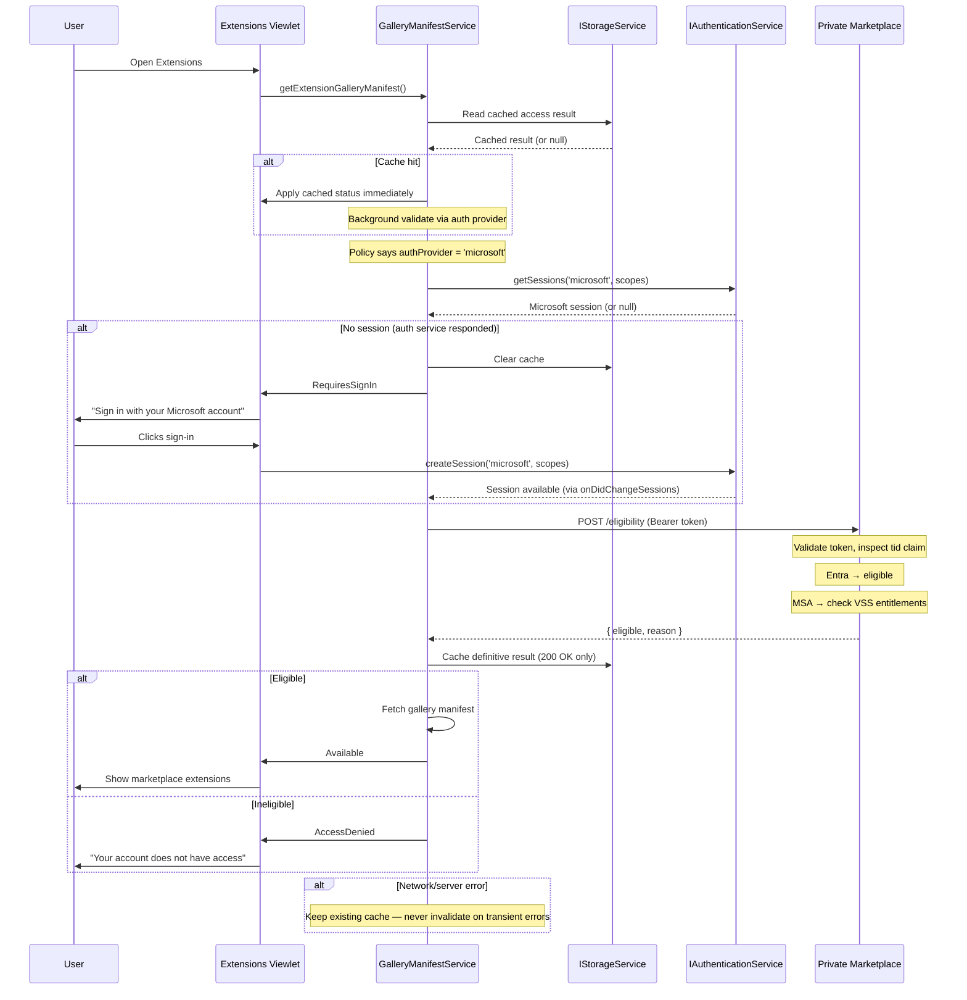

# Plan: Entra ID & Visual Studio Subscription Eligibility for Private Marketplace

## Overview

The Private Marketplace currently only allows access via GitHub Enterprise / Copilot sign-in, blocking enterprise customers who use Microsoft Entra ID or Visual Studio Subscriptions. This plan adds two new eligibility paths — Entra ID and Visual Studio Subscription — alongside the existing GitHub path.

A new enterprise policy field (`extensions.gallery.authProvider`) tells VS Code which auth provider the configured marketplace accepts. `GalleryManifestService` reads this policy and routes to the correct auth flow — either the existing GitHub/GHE path or a new Microsoft path. When the user needs to sign in, VS Code tells them exactly which account to use based on the policy — no picker, no guessing. Account classification and subscription checks happen server-side on the Private Marketplace — the VS Code client never parses tokens.

### Eligibility Matrix

| Path | Eligible | Notes |
|------|----------|-------|
| GitHub Enterprise / Copilot | Yes | Existing (unchanged) |
| Entra ID (work/school) | Yes | New |
| Visual Studio Subscription | Yes | New — regardless of sign-in type |
| MSA only, no VSS | No | Explicitly excluded |

### Key Architecture Decisions

| Decision | Outcome |
|----------|---------|
| Provider routing | New `extensions.gallery.authProvider` policy field (`'github'` or `'microsoft'`) |
| Service design | No new service — Microsoft auth logic (~40 lines) added directly to `GalleryManifestService` |
| Sign-in UX | Provider-specific sign-in message (no picker — policy determines the provider) |
| Account type detection | Server-side classification by Private Marketplace (no client token parsing) |
| VSS entitlement check | Server-side proxy via Private Marketplace → Ev4 API |
| Eligibility API hosting | Private Marketplace (Gallery Backend) |
| Caching | Access result cached in storage above provider routing; only invalidated by auth service responses, never by network errors |

---

## Proposal

### Eligibility Check Flow

`GalleryManifestService` caches the access result in `IStorageService` and checks it **before** contacting any auth provider. If a cache hit exists, the result is applied immediately (marketplace available without delay) and the provider-specific check runs in the background. Both flows benefit equally.

**Startup (cache-first):**
1. Read cached access result from storage
2. If cache hit → apply immediately (show marketplace or appropriate status)
3. Background-validate via the auth provider (steps below)
4. If no cache → run provider check synchronously (user waits)

`GalleryManifestService` reads the `extensions.gallery.authProvider` policy and routes to one of two flows:

**GitHub provider** (`authProvider` = `'github'` or unset — existing behavior, unchanged):
1. `GalleryManifestService` → `DefaultAccountService.getDefaultAccount()`
2. `checkAccess(account)` — enterprise flag or Copilot SKU match
3. Eligible → cache result, fetch manifest; Ineligible → cache result, AccessDenied
4. Auth service error (e.g. unavailable) → do nothing, keep existing cache

**Microsoft provider** (`authProvider` = `'microsoft'` — new):
1. `GalleryManifestService` → `IAuthenticationService.getSessions('microsoft', scopes)`
2. Auth service unavailable (throws) → do nothing, keep existing cache
3. No session (auth service responded) → clear cache, `RequiresSignIn` ("Sign in with your Microsoft account")
4. Has session → POST token to Private Marketplace eligibility endpoint
5. Server returns 200 → cache the definitive result
6. Server error (non-200) → do nothing, keep existing cache
7. Server validates token, inspects `tid` claim:
   - Entra ID (work/school) → eligible
   - MSA → check VS Subscription entitlements server-side via Ev4 API
   - MSA with active qualifying subscription → eligible
   - MSA without subscription → ineligible
8. Eligible → fetch manifest; Ineligible → AccessDenied

### Auth Flow: Microsoft Provider

### Auth Flow: GitHub Provider (unchanged)

When `authProvider` is `'github'` (or unset), the existing flow is preserved exactly:
`GalleryManifestService` → `DefaultAccountService.getDefaultAccount()` → `checkAccess(account)`.

No changes to the GitHub path.

### Sign-In UX

The sign-in prompt tells the user exactly which account to use, based on the `authProvider` policy — no provider picker needed.

The sign-in command reads the policy and routes directly:
- `authProvider === 'microsoft'` → `authenticationService.createSession('microsoft', scopes)`
- Otherwise → `commandService.executeCommand(DEFAULT_ACCOUNT_SIGN_IN_COMMAND)` (existing GitHub flow)

#### UX Messages

| State | Microsoft provider | GitHub provider (default) |
|-------|-------------------|--------------------------|
| **RequiresSignIn** | "Sign in with your Microsoft account to access the Extensions Marketplace." | "Sign in with GitHub to access the Extensions Marketplace." |
| **AccessDenied** | "Your Microsoft account does not have access. An Entra ID (work or school) account or Visual Studio Subscription is required." | "Your account does not have access. Please contact your administrator." |

### Caching & Air-Gapped Support

The access result is cached in `IStorageService` (`StorageScope.APPLICATION`, `StorageTarget.MACHINE`) and sits **above** provider routing, following the same pattern as `DefaultAccountService`. Both GitHub and Microsoft flows read from and write to the same cache. This ensures the marketplace works on reload even when connectivity is unavailable.

**Behavior:**
- **Startup with cache:** Apply cached result immediately (before any auth or network calls), then validate via the auth provider in the background. If the background result differs, update status.
- **Startup without cache:** Check eligibility synchronously via the provider (user waits for result).
- **Network/server error with cache:** Keep using cached result — don't disrupt the user. Cache is never touched.
- **Network/server error without cache:** No status change (user sees initial state).

**Cache is invalidated when (auth service responses only):**
- `onDidChangeSessions('microsoft')` — auth service reports session added, removed, or changed
- `onDidChangeDefaultAccount` — auth service reports GitHub account changed or removed
- `getSessions()` returns empty array — auth service confirms no sessions exist (sign-out)
- Policy configuration changes — admin changed `authProvider` or `serviceUrl`

**Cache is NOT invalidated when:**
- Network timeout or DNS failure contacting the eligibility endpoint
- Eligibility endpoint returns non-200 (server error, 500, 503, etc.)
- `getSessions()` throws (auth service itself is unavailable)
- Manifest fetch fails after a successful eligibility check
- Any transient or recoverable error

### Policy Configuration

**Modify:** `src/vs/workbench/contrib/extensions/browser/extensions.contribution.ts`
- Add `extensions.gallery.authProvider` policy-controlled configuration (string enum: `'github'` | `'microsoft'`)

**Modify:** `src/vs/platform/extensionManagement/common/extensionGalleryManifest.ts`
- Add `ExtensionGalleryAuthProviderConfigKey` constant

### Gallery Manifest Integration

**Modify:** `src/vs/workbench/services/extensionManagement/electron-browser/extensionGalleryManifestService.ts`
- Add `IAuthenticationService` and `IStorageService` to constructor DI
- Read cached access result on startup **before** provider routing — apply immediately if present
- Add provider routing in `doGetExtensionGalleryManifest()` — read `extensions.gallery.authProvider` to choose GitHub or Microsoft path
- Both `handleGitHubAccess()` and `handleMicrosoftAccess()` cache their results on success
- Add `getCachedAccess()` / `cacheAccess()` / `clearCachedAccess()` — provider-agnostic, persist in `IStorageService`
- Only cache definitive results: 200 OK from eligibility endpoint, or definitive `checkAccess` result
- Never invalidate cache on network/transient errors — only on auth service responses
- Add `checkMicrosoftEligibility()` — HTTP POST; throws on non-200 (server errors are not cacheable)
- Subscribe to `onDidChangeSessions('microsoft')` / `onDidChangeDefaultAccount` — clear cache and re-evaluate
- Set `marketplaceAuthProvider` context key from policy value

### Extensions UI

**Modify:** `src/vs/workbench/contrib/extensions/browser/extensionsViewlet.ts`
- Provider-aware RequiresSignIn: Microsoft → "Sign in with your Microsoft account"; GitHub → "Sign in with GitHub"
- Provider-aware AccessDenied: Microsoft → "Entra ID or VSS required"; GitHub → "Contact your administrator"
- Messages conditioned on `marketplaceAuthProvider` context key

**Modify:** `src/vs/workbench/contrib/extensions/browser/extensions.contribution.ts`
- Provider-routed sign-in command (reads `authProvider` policy, routes to correct `createSession` call)

**Modify:** `src/vs/workbench/contrib/extensions/common/extensions.ts`
- Add context key: `marketplaceAuthProvider` (string, set from policy)

### Product Configuration

**Modify:** `product.json` — add `microsoft` to `trustedExtensionAuthAccess`:

```jsonc
"trustedExtensionAuthAccess": {
    "github": ["GitHub.copilot-chat"],
    "github-enterprise": ["GitHub.copilot-chat"],
    "microsoft": []
}
```

The `microsoft` entry reserves the key for future extension-based callers. Since the eligibility service runs in the workbench (main process), it may not need explicit trust — but this should be verified during implementation by testing whether `getSessions('microsoft')` returns sessions without a trust prompt.

---

## Open Questions / Dependencies

- Private Marketplace eligibility endpoint URL and API contract (TBD)
- Ev4 onboarding: Private Marketplace AAD app registration with VS Subscriptions team
- Microsoft auth scopes for eligibility endpoint (TBD)
- Qualifying `subscriptionLevelCode` / `subscriptionChannel` combinations (coordinate with Aaron Mast / Chee Seong Ong)
- **Air-gapped / offline:** Resolved — access result is cached in storage (`StorageScope.APPLICATION`) above provider routing. On startup, the cached result is applied immediately before any auth or network calls. Background validation runs through the provider flow when connectivity is available. Cache is only invalidated by auth service responses, never by network errors.
