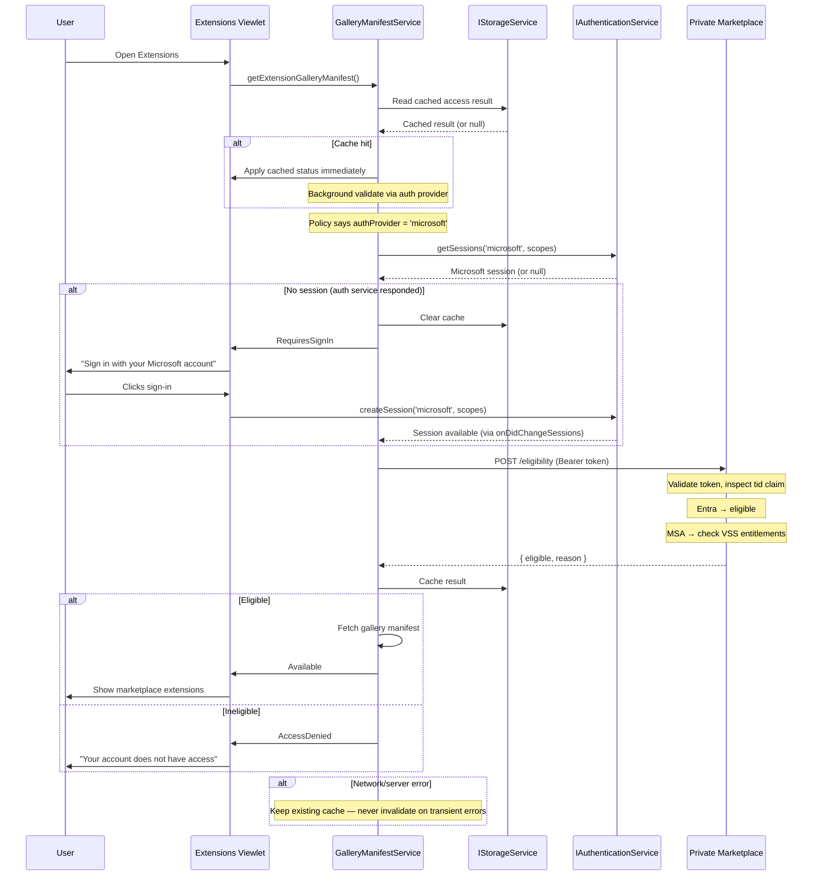

# Plan: Entra ID & VSS Eligibility for Private Marketplace

> **Issue:** [#280376](https://github.com/microsoft/vscode/issues/280376)

## Overview

The Private Marketplace currently only allows access via GitHub Enterprise / Copilot sign-in, blocking enterprise customers who use Microsoft Entra ID or Visual Studio Subscriptions. This plan adds two new eligibility paths — Entra ID and Visual Studio Subscription — alongside the existing GitHub path.

A new enterprise policy field (`extensions.gallery.authProvider`) tells VS Code which auth provider the configured marketplace accepts. `GalleryManifestService` reads this policy and routes to the correct auth flow — either the existing GitHub/GHE path or a new Microsoft path. When the user needs to sign in, VS Code tells them exactly which account to use based on the policy. Account classification and subscription checks happen server-side on the Private Marketplace — the VS Code client never parses tokens.

### Eligibility Matrix

| Path | Eligible | Notes |
|------|----------|-------|
| GitHub Enterprise / Copilot | Yes | Existing behavior |
| Entra ID (work/school) | Yes | New |
| Visual Studio Subscription | Yes | New — regardless of sign-in type |
| MSA only, no VSS | No | Explicitly excluded |


### Key Architecture Decisions

| Decision | Outcome |
|----------|---------|
| Provider routing | New `extensions.gallery.authProvider` policy field (`'github'` or `'microsoft'`) |
| Service design | Microsoft auth logic (~40 lines) added directly to `GalleryManifestService` |
| Sign-in UX | Provider-specific sign-in message (policy determines the provider) |
| Account type detection | Server-side classification by Private Marketplace (no client token parsing) |
| VSS entitlement check | Server-side proxy via Private Marketplace → Ev4 API |
| Eligibility API hosting | Private Marketplace (Gallery Backend) |
| Caching | Access result cached in storage above provider routing; used on startup before any auth calls; only invalidated by auth service responses, never by network errors |

---

## Design

### Provider Routing via Policy

The admin configures **two** policy fields:

```
extensions.gallery.serviceUrl = "https://marketplace.contoso.com/..."
extensions.gallery.authProvider = "microsoft"    ← NEW
```

`GalleryManifestService` reads the `authProvider` value and routes to the correct auth flow:
- `'github'` (or unset) → existing `DefaultAccountService` flow, unchanged
- `'microsoft'` → new Microsoft auth flow (get session → POST token to server → eligible/ineligible)

No waterfall. No guessing. One code path per provider.

### Cache-First Startup

On startup, `GalleryManifestService` reads the cached access result from storage **before** contacting any auth provider. If a valid cache entry exists, it applies it immediately (so the marketplace is available without delay) and then validates via the auth provider in the background. This benefits both flows equally — a restart with working cache never blocks on auth or network.

The cache is only invalidated by **definitive auth service responses** (session change, sign-out, account mismatch). Network errors, server errors, and transient failures never invalidate the cache.

### Auth Flow: Microsoft Provider



### Auth Flow: GitHub Provider (unchanged)

When `authProvider` is `'github'` (or unset), the existing flow is preserved exactly:
`GalleryManifestService` → `DefaultAccountService.getDefaultAccount()` → `checkAccess(account)`.

No changes to the GitHub path.

### Sign-In UX

The sign-in prompt tells the user exactly which account to use, based on the `authProvider` policy. The sign-in command reads the policy and routes directly:
- `authProvider === 'microsoft'` → `authenticationService.createSession('microsoft', scopes)`
- Otherwise → `commandService.executeCommand(DEFAULT_ACCOUNT_SIGN_IN_COMMAND)` (existing GitHub flow)

#### UX Messages

| State | Microsoft provider | GitHub provider (default) |
|-------|-------------------|---------------------------|
| **RequiresSignIn** | "Sign in with your Microsoft account to access the Extensions Marketplace." | "Sign in with GitHub to access the Extensions Marketplace." |
| **AccessDenied** | "Your Microsoft account does not have access. An Entra ID (work or school) account or Visual Studio Subscription is required." | "Your account does not have access. Please contact your administrator." |

---

## Implementation Plan

### Step 1: Add `extensions.gallery.authProvider` Policy

**Modify:** `src/vs/workbench/contrib/extensions/browser/extensions.contribution.ts`

Add a new policy-controlled configuration alongside the existing `extensions.gallery.serviceUrl`:

```typescript
'extensions.gallery.authProvider': {
    type: 'string',
    enum: ['github', 'microsoft'],
    description: localize('extensions.gallery.authProvider',
        "Configure the authentication provider for the Extensions Marketplace"),
    default: '',
    scope: ConfigurationScope.APPLICATION,
    included: false,
    policy: {
        name: 'ExtensionGalleryAuthProvider',
        category: PolicyCategory.Extensions,
        minimumVersion: '1.99',
        localization: {
            description: {
                key: 'extensions.gallery.authProvider',
                value: localize('extensions.gallery.authProvider',
                    "Configure the authentication provider for the Extensions Marketplace"),
            }
        }
    },
},
```

**Modify:** `build/lib/policies/policyData.jsonc` — add the new policy entry (auto-generated via `code --export-policy-data`).

### Step 2: Expose Auth Provider Config to Services

**Modify:** `src/vs/platform/extensionManagement/common/extensionGalleryManifest.ts`

Add the config key constant:

```typescript
export const ExtensionGalleryAuthProviderConfigKey = 'extensions.gallery.authProvider';
```

### Step 3: Add Microsoft Auth to `GalleryManifestService`

**Modify:** `src/vs/workbench/services/extensionManagement/electron-browser/extensionGalleryManifestService.ts`

#### 3a. Add `IAuthenticationService` and `IStorageService` to constructor DI

```typescript
constructor(
    // ... existing parameters ...
    @IAuthenticationService private readonly authenticationService: IAuthenticationService,
    @IStorageService private readonly storageService: IStorageService,
)
```

#### 3b. Initialization flow in `GalleryManifestService`

The private marketplace initialization is split into focused methods:

1. **`doGetExtensionGalleryManifest()`** — Entry point. Dispatches to `initializePrivateMarketplace()` when a `configuredServiceUrl` is set, otherwise uses the default manifest. Registers a config change listener that clears cache and prompts restart.

2. **`initializePrivateMarketplace(configuredServiceUrl)`** — Coordinates the startup sequence:
   - Apply cached access result immediately (before any auth calls)
   - Call `resolveAccessStrategy()` to determine the auth provider and set up event subscriptions
   - Run the returned `validateAccess()` function — foreground if no cache (user waits), background if cache was already applied

3. **`resolveAccessStrategy(configuredServiceUrl)`** — Resolves the effective auth provider and returns a validate function:
   - If `authProvider === 'microsoft'`: calls `discoverEligibilityUrl()` to look up the `EligibilityService` resource from the gallery manifest. If found, returns `handleMicrosoftAccess` bound to that URL and subscribes to `onDidChangeSessions('microsoft')`. If not found, logs and falls back to GitHub.
   - Otherwise (GitHub or unset): returns `handleGitHubAccess` and subscribes to `onDidChangeDefaultAccount`.

4. **`discoverEligibilityUrl(configuredServiceUrl)`** — Fetches the gallery manifest (ServiceIndex) and looks up the `EligibilityService` resource via `getExtensionGalleryManifestResourceUri()`. Returns the URL or `undefined`.

This structure eliminates the duplicated microsoft/github branching — each provider appears exactly once in `resolveAccessStrategy`, and the caller doesn't need to know which was selected.

**Eligibility URL discovery:** The eligibility endpoint is **not hardcoded**. When `authProvider` is `'microsoft'`, the service discovers the URL from the gallery manifest's `resources` array (the `EligibilityService` entry). If the Private Marketplace does not advertise this resource, the feature falls back to GitHub-only authentication. This makes the feature opt-in on the server side.

#### 3c. Provider-specific handlers

**`handleGitHubAccess(configuredServiceUrl)`** — Preserves the existing `DefaultAccountService`-based check. Gets the default account, calls `checkAccess()` (SKU match or enterprise flag), caches the result, and updates status.

**`handleMicrosoftAccess(configuredServiceUrl, eligibilityUrl)`** — New Microsoft flow:
- Gets sessions via `authenticationService.getSessions('microsoft', scopes)`
- If no sessions (definitive response) → clears cache, sets `RequiresSignIn`
- If session exists → POSTs the token to the eligibility URL, caches the result, fires telemetry, and updates status
- Non-200 responses throw (treated as transient — cache is preserved)

**`checkMicrosoftEligibility(url, token)`** — POSTs the bearer token to the eligibility endpoint, expects `{ eligible, reason }`. Throws on non-200 to distinguish server errors from definitive results.

#### 3d. Access caching

The access result is cached in `IStorageService` (`StorageScope.APPLICATION`, `StorageTarget.MACHINE`) and sits **above** provider routing. Both GitHub and Microsoft flows read from and write to the same cache key.

**Cache invalidation rules:**
- **Invalidated by:** auth service events (`onDidChangeSessions`, `onDidChangeDefaultAccount`), definitive empty-session responses, policy config changes
- **Never invalidated by:** network errors, server errors (non-200), `getSessions()` throwing, manifest fetch failures

#### 3e. Set the `marketplaceAuthProvider` context key

For the sign-in UX to show the right message:

```typescript
// In constructor or doGetExtensionGalleryManifest():
const authProvider = this.configurationService.getValue<string>(ExtensionGalleryAuthProviderConfigKey);
CONTEXT_MARKETPLACE_AUTH_PROVIDER.bindTo(contextKeyService).set(authProvider || 'github');
```

### Step 4: Update Sign-In UX

**Modify:** `src/vs/workbench/contrib/extensions/browser/extensionsViewlet.ts`

Replace the generic sign-in message with provider-specific messages:

```typescript
// Microsoft marketplace — tell the user exactly which account
viewRegistry.registerViewWelcomeContent('workbench.views.extensions.marketplaceAccess', {
    content: localize('sign in microsoft',
        "[Sign in with your Microsoft account]({0}) to access the Extensions Marketplace.",
        `command:workbench.extensions.actions.gallery.signIn`),
    when: ContextKeyExpr.and(
        CONTEXT_EXTENSIONS_GALLERY_STATUS.isEqualTo(ExtensionGalleryManifestStatus.RequiresSignIn),
        CONTEXT_MARKETPLACE_AUTH_PROVIDER.isEqualTo('microsoft')
    )
});

// GitHub marketplace (default)
viewRegistry.registerViewWelcomeContent('workbench.views.extensions.marketplaceAccess', {
    content: localize('sign in github',
        "[Sign in with GitHub]({0}) to access the Extensions Marketplace.",
        `command:workbench.extensions.actions.gallery.signIn`),
    when: ContextKeyExpr.and(
        CONTEXT_EXTENSIONS_GALLERY_STATUS.isEqualTo(ExtensionGalleryManifestStatus.RequiresSignIn),
        ContextKeyExpr.or(
            CONTEXT_MARKETPLACE_AUTH_PROVIDER.isEqualTo('github'),
            ContextKeyExpr.not('marketplaceAuthProvider')
        )
    )
});

// AccessDenied (provider-aware)
viewRegistry.registerViewWelcomeContent('workbench.views.extensions.marketplaceAccess', {
    content: localize('access denied microsoft',
        "Your Microsoft account does not have access to the Extensions Marketplace. An Entra ID (work or school) account or Visual Studio Subscription is required. Please contact your administrator."),
    when: ContextKeyExpr.and(
        CONTEXT_EXTENSIONS_GALLERY_STATUS.isEqualTo(ExtensionGalleryManifestStatus.AccessDenied),
        CONTEXT_MARKETPLACE_AUTH_PROVIDER.isEqualTo('microsoft')
    )
});

viewRegistry.registerViewWelcomeContent('workbench.views.extensions.marketplaceAccess', {
    content: localize('access denied github',
        "Your account does not have access to the Extensions Marketplace. Please contact your administrator."),
    when: ContextKeyExpr.and(
        CONTEXT_EXTENSIONS_GALLERY_STATUS.isEqualTo(ExtensionGalleryManifestStatus.AccessDenied),
        ContextKeyExpr.or(
            CONTEXT_MARKETPLACE_AUTH_PROVIDER.isEqualTo('github'),
            ContextKeyExpr.not('marketplaceAuthProvider')
        )
    )
});
```

### Step 5: Provider-Routed Sign-In Command

**Modify:** `src/vs/workbench/contrib/extensions/browser/extensions.contribution.ts`

```typescript
registerAction2(class ExtensionsGallerySignInAction extends Action2 {
    constructor() {
        super({
            id: 'workbench.extensions.actions.gallery.signIn',
            title: localize2('signInToMarketplace', 'Sign in to access Extensions Marketplace'),
            menu: {
                id: MenuId.AccountsContext,
                when: ContextKeyExpr.or(
                    CONTEXT_EXTENSIONS_GALLERY_STATUS.isEqualTo(ExtensionGalleryManifestStatus.RequiresSignIn),
                    CONTEXT_EXTENSIONS_GALLERY_STATUS.isEqualTo(ExtensionGalleryManifestStatus.AccessDenied),
                )
            },
        });
    }
    async run(accessor: ServicesAccessor): Promise<void> {
        const configurationService = accessor.get(IConfigurationService);
        const authProvider = configurationService.getValue<string>(ExtensionGalleryAuthProviderConfigKey);

        if (authProvider === 'microsoft') {
            const authenticationService = accessor.get(IAuthenticationService);
            await authenticationService.createSession(
                'microsoft',
                ['https://marketplace.visualstudio.com/.default']);
        } else {
            const commandService = accessor.get(ICommandService);
            await commandService.executeCommand(DEFAULT_ACCOUNT_SIGN_IN_COMMAND);
        }
    }
});
```

### Step 6: Add Context Key

**Modify:** `src/vs/workbench/contrib/extensions/common/extensions.ts`

```typescript
export const CONTEXT_MARKETPLACE_AUTH_PROVIDER = new RawContextKey<string>('marketplaceAuthProvider', '');
```

### Step 7: Add Telemetry

Add a telemetry event to `handleMicrosoftAccess()`:

```typescript
type MarketplaceAuthEvent = {
    authProvider: string;
    eligible: boolean;
    reason: string;
};

type MarketplaceAuthClassification = {
    authProvider: {
        classification: 'SystemMetaData';
        purpose: 'FeatureInsight';
        comment: 'The auth provider used (github, microsoft).';
    };
    eligible: {
        classification: 'SystemMetaData';
        purpose: 'FeatureInsight';
        isMeasurement: true;
        comment: 'Whether the user was granted marketplace access.';
    };
    reason: {
        classification: 'SystemMetaData';
        purpose: 'FeatureInsight';
        comment: 'The eligibility reason returned by the server.';
    };
    owner: 'sandy081';
    comment: 'Reports marketplace authentication results for enterprise marketplace access.';
};
```

### Step 8: Add Unit Tests

**New file:** `src/vs/workbench/services/extensionManagement/test/electron-browser/extensionGalleryManifestService.test.ts`

Tests focus on provider routing and cache-first logic within `GalleryManifestService`:

| # | Test Case | Setup | Expected |
|---|-----------|-------|----------|
| 1 | Cache hit on startup — eligible | Cached `eligible: true` | `Available` immediately; background validates |
| 2 | Cache hit on startup — ineligible | Cached `eligible: false` | `AccessDenied` immediately; background validates |
| 3 | No cache — Microsoft provider, no session | `authProvider: 'microsoft'`, no sessions | `RequiresSignIn` |
| 4 | No cache — Microsoft provider, eligible (Entra) | `authProvider: 'microsoft'`, session, server 200 `eligible: true` | `Available`, result cached |
| 5 | No cache — Microsoft provider, ineligible | `authProvider: 'microsoft'`, session, server 200 `eligible: false` | `AccessDenied`, result cached |
| 6 | No cache — GitHub provider, enterprise account | `authProvider: 'github'`, enterprise account | `Available`, result cached |
| 7 | No cache — default (no authProvider) | No `authProvider` set | Uses GitHub path |
| 8 | Microsoft — server error (500), no cache | Server returns 500, no cached result | Status unchanged (no cache to use) |
| 9 | Microsoft — server error (500), with cache | Server returns 500, cached `eligible: true` | Cache preserved, status unchanged |
| 10 | GitHub — network error, with cache | `getDefaultAccount()` throws, cached `eligible: true` | Cache preserved, status unchanged |
| 11 | Cache invalidated on `onDidChangeSessions` | Fire `onDidChangeSessions('microsoft')` | Cache cleared, re-checks eligibility |
| 12 | Cache invalidated on `onDidChangeDefaultAccount` | Fire `onDidChangeDefaultAccount` | Cache cleared, re-checks GitHub access |
| 13 | Cache NOT invalidated on network error | Eligibility endpoint unreachable | Cache preserved |
| 14 | Cache NOT invalidated when `getSessions()` throws | Auth service unavailable | Cache preserved |
| 15 | Policy change clears cache | Admin changes `authProvider` | Cache cleared, restart requested |

### Step 9: Product Configuration

**Modify:** `product.json` — add `microsoft` to `trustedExtensionAuthAccess`:

```jsonc
"trustedExtensionAuthAccess": {
    "github": ["GitHub.copilot-chat"],
    "github-enterprise": ["GitHub.copilot-chat"],
    "microsoft": []
}
```

No new `extensionsGallery` fields needed. The eligibility URL is discovered at runtime from the gallery manifest's `resources` array (the `EligibilityService` resource type). If the Private Marketplace does not include this resource, the Microsoft auth path is not available and the client falls back to GitHub-only. Auth scopes are hardcoded as constants.

---

## Component Architecture

```
┌─────────────────────────────────────────────────────────────┐
│  Policy Configuration                                       │
│  ┌─────────────────────────┐  ┌──────────────────────────┐  │
│  │ extensions.gallery      │  │ extensions.gallery        │  │
│  │   .serviceUrl           │  │   .authProvider           │  │
│  │ = "https://..."         │  │ = "microsoft"             │  │
│  └───────────┬─────────────┘  └─────────────┬────────────┘  │
└──────────────┼──────────────────────────────┼───────────────┘
               │                              │
               ▼                              ▼
┌──────────────────────────────────────────────────────────────┐
│  GalleryManifestService                                      │
│                                                              │
│  ┌──────── Cache Layer (above routing) ────────┐             │
│  │  IStorageService → getCachedAccess()         │             │
│  │  Cache hit → apply immediately               │             │
│  │  Background validate via provider below      │             │
│  │  Only invalidated by auth service responses  │             │
│  └──────────────────────────────────────────────┘             │
│                         │                                    │
│  ┌────────────── Provider Router ──────────────┐             │
│  │                                             │             │
│  │  Discover EligibilityService URL from       │             │
│  │  gallery manifest resources (ServiceIndex)  │             │
│  │                                             │             │
│  │  If URL found AND authProvider === 'microsoft'            │
│  │    → handleMicrosoftAccess(url, eligibilityUrl)           │
│  │    → IAuthenticationService.getSessions()   │             │
│  │    → POST eligibilityUrl (Bearer token)     │             │
│  │    → cacheAccess() on 200 OK only           │             │
│  │                                             │             │
│  │  If URL NOT found → fall back to GitHub     │             │
│  │  authProvider === 'github' (or unset)       │             │
│  │    → handleGitHubAccess()                   │             │
│  │    → DefaultAccountService.getDefaultAccount()            │
│  │    → checkAccess(account) → cacheAccess()   │             │
│  │                                             │             │
│  └─────────────────────────────────────────────┘             │
└──────────────────────────────────────────────────────────────┘
               │
               ▼
┌──────────────────────────────────────────────────────────────┐
│  Extensions Viewlet                                          │
│                                                              │
│  RequiresSignIn (provider-aware):                            │
│    Microsoft → "Sign in with your Microsoft account"         │
│    GitHub    → "Sign in with GitHub"                         │
│                                                              │
│  AccessDenied (provider-aware):                              │
│    Microsoft → "Entra ID or VSS required"                    │
│    GitHub    → "Contact your administrator"                  │
│                                                              │
└──────────────────────────────────────────────────────────────┘
```

---

## Files Summary

| File | Action | Notes |
|------|--------|-------|
| `src/vs/workbench/contrib/extensions/browser/extensions.contribution.ts` | **Modify** | Add `extensions.gallery.authProvider` policy; provider-routed sign-in command |
| `src/vs/platform/extensionManagement/common/extensionGalleryManifest.ts` | **Modify** | Add `ExtensionGalleryAuthProviderConfigKey` constant; add `EligibilityService` to `ExtensionGalleryResourceType` |
| `src/vs/workbench/services/extensionManagement/electron-browser/extensionGalleryManifestService.ts` | **Modify** | Add `IAuthenticationService` DI, eligibility URL discovery from manifest, provider routing, `handleMicrosoftAccess()` |
| `src/vs/workbench/contrib/extensions/browser/extensionsViewlet.ts` | **Modify** | Provider-aware sign-in and access-denied messages |
| `src/vs/workbench/contrib/extensions/common/extensions.ts` | **Modify** | Add `marketplaceAuthProvider` context key |
| `product.json` | **Modify** | Add `microsoft` to `trustedExtensionAuthAccess` |
| `src/vs/workbench/services/extensionManagement/test/electron-browser/extensionGalleryManifestService.test.ts` | **New** | Tests for provider routing, eligibility URL discovery, and Microsoft eligibility |

---

## Open Questions / Dependencies

- **Policy rollout:** Is `extensions.gallery.authProvider` delivered alongside `extensions.gallery.serviceUrl` in the same group policy? Can they be bundled?
- **Both providers:** Some marketplaces may accept both GitHub and Microsoft. Should `authProvider` support an array? Start with single-provider, extend later if needed.
- **Backward compatibility:** If `authProvider` is unset but `serviceUrl` is configured, default to `'github'` (preserves current behavior).
- ~~Private Marketplace eligibility endpoint URL and API contract (TBD)~~ **Resolved:** The eligibility URL is discovered from the gallery manifest's `resources` array (`EligibilityService` resource type). If the Private Marketplace doesn't advertise it, the feature falls back to GitHub-only.
- **Private Marketplace ServiceIndex contract:** The Private Marketplace must include `{ "id": "<url>", "type": "EligibilityService" }` in the gallery manifest `resources` array to enable the Microsoft auth path.
- Ev4 onboarding: Private Marketplace AAD app registration with VS Subscriptions team
- Microsoft auth scopes for eligibility endpoint (TBD)
- Qualifying `subscriptionLevelCode` / `subscriptionChannel` combinations (coordinate with Aaron Mast / Chee Seong Ong)
- **Air-gapped / offline:** Resolved — access result is cached in storage (`StorageScope.APPLICATION`) above provider routing. On startup, the cached result is applied immediately before any auth or network calls. Background validation runs through the provider flow when connectivity is available. Cache is only invalidated by auth service responses, never by network errors.

---

## Verification

1. **Build:** Check `VS Code - Build` task output for compilation errors
2. **Layering:** `npm run valid-layers-check`
3. **Unit tests:** `scripts\test.bat --grep "GalleryManifestService"`
4. **Manual testing:**
   - `authProvider: 'microsoft'` + manifest has `EligibilityService` resource + no session → shows "Sign in with your Microsoft account"
   - `authProvider: 'microsoft'` + manifest has `EligibilityService` resource + Entra session → marketplace loads
   - `authProvider: 'microsoft'` + manifest has `EligibilityService` resource + MSA without VSS → access denied with clear message
   - `authProvider: 'microsoft'` + manifest does NOT have `EligibilityService` resource → falls back to GitHub auth
   - `authProvider: 'github'` (or unset) → existing behavior unchanged
5. **Hygiene:** Pre-commit hook / `gulp hygiene`
