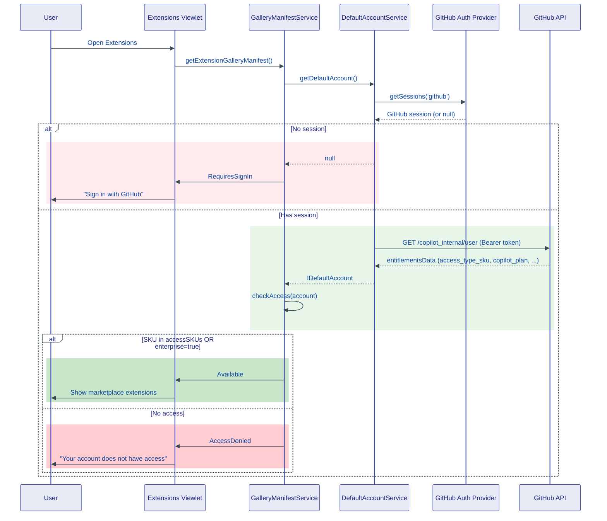
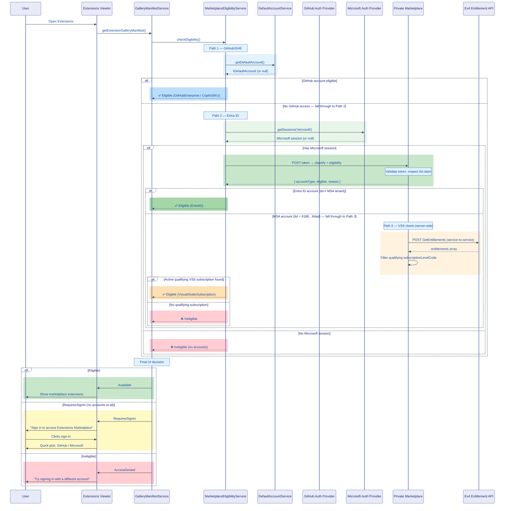
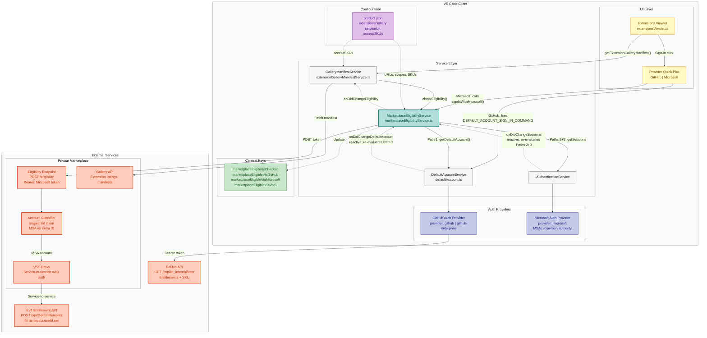

# Plan: Entra ID & Visual Studio Subscription Eligibility for Private Marketplace

> **Issue:** [#280376 — Enable VS Code sign-in with Microsoft Entra ID to connect to Private Marketplace](https://github.com/microsoft/vscode/issues/280376)

## TL;DR

The Private Marketplace is currently gated solely on GitHub Enterprise / Copilot sign-in, blocking ~50% of enterprise pilot customers who rely on Microsoft Entra ID or Visual Studio Subscriptions. This plan introduces a new `IMarketplaceEligibilityService` that evaluates access from three independent paths — existing GitHub/GHE, Entra ID (work/school), and Visual Studio Subscription — without modifying the Copilot-focused `DefaultAccountProvider`. The Extensions viewlet is updated with a unified sign-in command that presents a provider picker (GitHub or Microsoft). The client uses `vscode.authentication.getSession('microsoft', scopes)` to acquire a token and sends it to the Private Marketplace's eligibility endpoint — the client never parses tokens locally. The Private Marketplace validates the token, classifies the account type by inspecting the `tid` claim (MSA tenant `9188040d-6c67-4c5b-b112-36a304b66dad`), checks VSS entitlements for MSA users, and returns a unified eligibility result.

### Eligibility Matrix

| Path                          | Eligible | Notes                         |
|-------------------------------|----------|-------------------------------|
| GitHub Enterprise / Copilot   | Yes      | Existing behavior (unchanged) |
| Entra ID (work/school)        | Yes      | New — classified after sign-in |
| Visual Studio Subscription    | Yes      | New — regardless of sign-in ID|
| MSA only, no VSS              | No       | Explicitly excluded           |


---

## How It Works Today

### Auth Flow



> **Color key:**
>
> | Color | Meaning |
> |-------|--------|
> | 🟢 Green | Eligible / access granted |
> | 🔴 Red | Ineligible / access denied |

### Access Gating

The marketplace access check lives in `WorkbenchExtensionGalleryManifestService.checkAccess()` at `src/vs/workbench/services/extensionManagement/electron-browser/extensionGalleryManifestService.ts`:

```typescript
private checkAccess(account: IDefaultAccount): boolean {
    if (account.entitlementsData?.access_type_sku &&
        this.productService.extensionsGallery?.accessSKUs?.includes(account.entitlementsData.access_type_sku)) {
        return true;
    }
    return account.enterprise;
}
```

Two paths: SKU match via `accessSKUs`, or the `enterprise` boolean flag (set when using `github-enterprise` auth provider).

### Key Components

- **`DefaultAccountProvider`** — `src/vs/workbench/services/accounts/browser/defaultAccount.ts`. Hardwired to GitHub: provider selection is `github` (default) or `github-enterprise` (when `github.copilot.advanced.authProvider` is configured). Entitlements fetched from `https://api.github.com/copilot_internal/user`. No `microsoft` provider option exists.

- **Microsoft Authentication Extension** — `extensions/microsoft-authentication/`. Already supports both MSA and Entra ID (AAD). Provider ID: `microsoft`. MSA tenant: `9188040d-6c67-4c5b-b112-36a304b66dad`. Uses MSAL v2 by default. Supports `VSCODE_CLIENT_ID:<id>` and `VSCODE_TENANT:<tenant>` scope prefixes.

- **Extensions Viewlet** — `src/vs/workbench/contrib/extensions/browser/extensionsViewlet.ts`. Has a `marketplaceAccess` view with `RequiresSignIn` and `AccessDenied` welcome content, but only offers GitHub sign-in.


---

## Proposed Design

The new `MarketplaceEligibilityService` sits between the `GalleryManifestService` and the auth providers, evaluating eligibility across three independent paths before the manifest service makes its access decision.



> **Color key:**
>
> | Color | Meaning |
> |-------|---------|
> | 🔵 Blue | **Path 1** — GitHub / GHE eligibility |
> | 🟢 Green | **Path 2** — Entra ID eligibility |
> | 🟠 Orange | **Path 3** — VSS entitlement check |
> | 🟡 Yellow | Requires sign-in (prompt state) |
> | 🔴 Red | Ineligible / access denied |

### Sign-In Flow Design

The sign-in flows for GitHub and Microsoft are **intentionally asymmetric** — reactive for GitHub, imperative for Microsoft. This reflects existing ownership boundaries rather than an inconsistency.

| | GitHub path | Microsoft path |
|-|-------------|----------------|
| **Who triggers sign-in?** | Quick pick fires `DEFAULT_ACCOUNT_SIGN_IN_COMMAND`, owned by `DefaultAccountService` | Quick pick calls `MES.signInWithMicrosoft()` |
| **Who calls the auth provider?** | `DefaultAccountService` calls `createSession('github', …)` | `MES` calls `createSession('microsoft', …)` |
| **How does `MES` learn about it?** | Reactively — subscribes to `onDidChangeDefaultAccount` | Directly — it initiated the call, then also subscribes to `onDidChangeSessions('microsoft')` for external sign-ins |
| **Why?** | `DefaultAccountService` already owns the full GitHub lifecycle (sign-in, entitlement fetch, caching). Duplicating that would couple `MES` to GitHub internals. | No existing service owns Microsoft sign-in for marketplace purposes. The scopes and eligibility URL are `MES`'s own configuration. |

**Why `signInWithMicrosoft()` lives on `MES`:** The method is a thin trigger — it delegates to `authenticationService.createSession('microsoft', scopes)` and returns. All auth logic (MSAL, token acquisition, browser redirect) remains in `IAuthenticationService` and the Microsoft auth extension. The scopes and provider config needed for the call are already on `MES` (it needs them for silent session discovery on startup). Extracting this into a separate service would create a second service coupled to the same configuration, with no additional responsibility.

### Component Architecture

The following diagram shows the structural relationships between all components in the proposed architecture. The `MarketplaceEligibilityService` is the central coordination point, evaluating three independent eligibility paths (GitHub, Entra ID, Visual Studio Subscription) and exposing a unified result to the `GalleryManifestService`.



> **Color key:**
>
> | Color | Meaning |
> |-------|--------|
> | 🟦 Teal | New component (`MarketplaceEligibilityService`) |
> | ⬜ Gray | Existing services (`GalleryManifestService`, `DefaultAccountService`, `IAuthenticationService`) |
> | 🔵 Indigo | Auth providers (GitHub, Microsoft) |
> | 🟨 Yellow | UI layer (Extensions Viewlet, Provider Picker) |
> | 🟥 Red / Orange | External services (Private Marketplace, Ev4, GitHub API) |
> | 🟪 Purple | Configuration (`product.json`) |
> | 🟢 Green | Context keys for UI state |
> | **Solid arrows** | Direct method calls / HTTP requests |
> | **Dashed arrows** | Event subscriptions / reactive updates |


### Architecture Decision Records

The following architectural decisions underpin this design. Full details are in the [Appendix](#appendix-architecture-decision-records).

| # | Decision | Outcome |
|---|----------|---------|
| 1 | [Marketplace Eligibility Service Design](#architecture-decision-marketplace-eligibility-service-design) | Separate `IMarketplaceEligibilityService` |
| 2 | [Marketplace Sign-In UX](#architecture-decision-marketplace-sign-in-ux) | Single command with provider picker |
| 3 | [Microsoft Account Type Detection Strategy](#architecture-decision-microsoft-account-type-detection-strategy) | Private Marketplace classification endpoint |
| 4 | [VSS Entitlement Check Strategy](#architecture-decision-vss-entitlement-check-strategy) | Server-side proxy via Private Marketplace |
| 5 | [Eligibility API Hosting Strategy](#architecture-decision-eligibility-api-hosting-strategy) | Private Marketplace (Gallery Backend) |


---

## Implementation Steps

### Step 1: Define `IMarketplaceEligibilityService` Interface

**New file:** `src/vs/workbench/services/extensionManagement/common/marketplaceEligibility.ts`

```typescript
export const enum MarketplaceEligibilityReason {
    GitHubEnterprise = 'gitHubEnterprise',
    CopilotSKU = 'copilotSKU',
    EntraID = 'entraID',
    VisualStudioSubscription = 'visualStudioSubscription',
    Ineligible = 'ineligible',
}

export interface IMarketplaceEligibility {
    readonly eligible: boolean;
    readonly reason: MarketplaceEligibilityReason;
}

export interface IMarketplaceEligibilityService {
    readonly _serviceBrand: undefined;
    checkEligibility(): Promise<IMarketplaceEligibility>;
    readonly onDidChangeEligibility: Event<IMarketplaceEligibility>;
    signInWithMicrosoft(): Promise<void>;
}

export const IMarketplaceEligibilityService =
    createDecorator<IMarketplaceEligibilityService>('marketplaceEligibilityService');
```

### Step 2: Implement `MarketplaceEligibilityService`

**New file:** `src/vs/workbench/services/extensionManagement/browser/marketplaceEligibilityService.ts`

**Injected services:** `IDefaultAccountService`, `IAuthenticationService`, `IRequestService`, `IProductService`, `ILogService`, `IContextKeyService`

#### Path 1 — GHE / Copilot (existing behavior, extracted)

```
defaultAccountService.getDefaultAccount()
  → entitlementsData.access_type_sku in productService.extensionsGallery.accessSKUs?
  → OR account.enterprise?
```

#### Path 2 — Entra ID (new)

Uses server-side classification (see [Account Type Detection](#architecture-decision-microsoft-account-type-detection-strategy)):

```
authenticationService.getSessions('microsoft')
  → POST token to serviceUrl + /_apis/public/gallery/eligibility
  → Private Marketplace validates token, inspects `tid` claim
  → Returns { accountType: 'Entra' | 'MSA', eligible: boolean, reason: string }
  → The client does NOT parse the token locally
```

Eligible if `accountType === 'Entra'`. If `accountType === 'MSA'`, the Private Marketplace automatically proceeds to Path 3 (Ev4 VSS check) before responding.

#### Path 3 — Visual Studio Subscription (new)

The Private Marketplace checks VSS entitlements via the **Ev4 Entitlement API** (`GetEntitlements`). See [VSS Entitlement Check Strategy](#architecture-decision-vss-entitlement-check-strategy) for the architectural decision and [Ev4 documentation](https://microsoft.sharepoint.com/:w:/r/teams/VSSubscriptionsteam/_layouts/15/guestaccess.aspx?share=IQHJQ2RY2KqCRI0hdomK7ByGAd0G75tyNf8y4KGANoZwI2o&fallback=1) for the full API spec.

**How it works (Private Marketplace calls Ev4):**

```
Client sends Microsoft auth token to Private Marketplace eligibility endpoint:
  → Private Marketplace extracts upn, oid, tid from the user's token
  → Private Marketplace acquires service-to-service token for Ev4
     (resource: 8fa6a811-8ec0-4398-94f1-650c48ec131e,
      tenant: 33e01921-4d64-4f8c-a055-5bdaffd5e33d)
  → POST https://fd-bs-prod.azurefd.net/api/GetEntitlements
     {
       "Upn": "user@contoso.com",
       "Site": "<assigned Site value>",
       "EntitlementBI": {
         "ObjectID": "<oid claim>",
         "TenantID": "<tid claim>"
       },
       "Filter": { "SubscriptionStatus": ["Active"] }
     }
  → Ev4 returns array of entitlements
  → Private Marketplace checks for qualifying subscriptionLevelCode
  → Returns { eligible: boolean, reason: string } to client
```

> **Note**: For MSA users, the `EntitlementBI` payload should use `PUID` instead of `ObjectID` + `TenantID`. The PUID is the MSA's hex integer identifier. The Private Marketplace should extract this from the token's `puid` claim (or convert from `oid`).

**Ev4 response shape** (from [Ev4 documentation](https://microsoft.sharepoint.com/:w:/r/teams/VSSubscriptionsteam/_layouts/15/guestaccess.aspx?share=IQHJQ2RY2KqCRI0hdomK7ByGAd0G75tyNf8y4KGANoZwI2o&fallback=1)):

```jsonc
[
  {
    "subscriptionLevelCode": "ENT-RETAIL",        // e.g., "ENT-RETAIL", "PRO-VL", etc.
    "subscriptionLevelName": "VS Enterprise with MSDN (Retail)",
    "subscriptionStatus": "Active",                // "Active" | "Grace" | "Ended" | "Hold" | "None"
    "subscriptionExpirationDate": "2022-10-08T17:00:00-07:00",
    "subscriptionEndedDate": null,                  // null = active; date = removed
    "subscriptionProgramCode": "MSDN",
    "subscriptionPriority": 1,
    "isSubscriptionVolumeLicense": false,
    "entitlementCode": "VSO-ADVP",                 // benefit type identifier
    "entitlementName": "Visual Studio Online Advanced",
    "entitlementType": "LicensingVso",             // Azure | Chat | CouponCode | Downloads | ...
    "isEntitlementAvailable": true,
    "subscriptionChannel": "Retail",
    "activated": true,
    "benefitDetailGuid": "8c02b93c-85ea-4826-a1c8-0e94aadd6249"
  }
  // ... more entitlements
]
```

**Key fields for eligibility determination:**
- `subscriptionStatus` — must be `"Active"` (use `Filter` to pre-filter)
- `subscriptionLevelCode` — identifies the subscription tier (e.g., `ENT-RETAIL`, `PRO-VL`). The set of qualifying codes needs to be agreed with the VS Subscriptions team.
- `subscriptionChannel` — e.g., `"Retail"`, `"Volume"`. May be used for additional filtering.
- `isSubscriptionVolumeLicense` — boolean flag, useful for distinguishing VL subscriptions.

This enables MSA users WITH active VSS to pass, per the eligibility matrix.

> **Note**: The `subscriptionExpirationDate` is unreliable per Ev4 docs. Use `subscriptionStatus` and `subscriptionEndedDate` (null = still assigned) for status determination.

#### Evaluation Order

Paths checked in priority order: **GHE → Entra → VSS**. First match wins.

#### Reactivity

- Subscribe to `defaultAccountService.onDidChangeDefaultAccount` (Path 1 changes)
- Subscribe to `authenticationService.onDidChangeSessions` filtered on `'microsoft'` provider (Paths 2 & 3 changes)
- Re-evaluate and fire `onDidChangeEligibility` on changes
- Cache results with TTL to avoid repeated API calls

### Step 3: Product Configuration — No New Fields Needed

No new fields are added to `product.json` or the `extensionsGallery` interface:

1. **`eligibilityUrl`** — Derived at runtime from `extensionsGallery.serviceUrl` + `/_apis/public/gallery/eligibility`. The eligibility endpoint is hosted on the Private Marketplace (Gallery Backend), so its base URL is already known.
2. **`accountClassificationUrl`** — Not needed. Account classification (Entra vs MSA) is performed by the same eligibility endpoint via `tid` claim inspection.
3. **`vssEntitlementUrl`** — Not needed on the client. The Private Marketplace handles the Ev4 call server-side with its own service-to-service credentials.
4. **`microsoftAuthScopes`** — Hardcoded as a constant in `MarketplaceEligibilityService`. The scopes target the Private Marketplace's own AAD app registration and are stable across product builds.

**Constants in `marketplaceEligibilityService.ts`:**

```typescript
const MARKETPLACE_ELIGIBILITY_PATH = '/_apis/public/gallery/eligibility';
const MARKETPLACE_MICROSOFT_AUTH_SCOPES = ['https://marketplace.visualstudio.com/.default'];
```

### Step 4: Modify `WorkbenchExtensionGalleryManifestService`

**Modify:** `src/vs/workbench/services/extensionManagement/electron-browser/extensionGalleryManifestService.ts`

This is the critical integration point. The current service has 13 DI parameters and directly calls `checkAccess(account)` synchronously. We need to:

#### 4a. Add `IMarketplaceEligibilityService` to constructor DI

```typescript
constructor(
	// ... existing 13 parameters ...
	@IMarketplaceEligibilityService private readonly marketplaceEligibilityService: IMarketplaceEligibilityService,
)
```

#### 4b. Replace `handleDefaultAccountAccess()` method

Current implementation (lines 107–127):

```typescript
private async handleDefaultAccountAccess(configuredServiceUrl: string): Promise<void> {
	const account = await this.defaultAccountService.getDefaultAccount();
	if (!account) {
		this.update(null, ExtensionGalleryManifestStatus.RequiresSignIn);
	} else if (!this.checkAccess(account)) {
		this.update(null, ExtensionGalleryManifestStatus.AccessDenied);
	} else if (this.currentStatus !== ExtensionGalleryManifestStatus.Available) {
		// ... fetch manifest and telemetry ...
	}
}
```

New implementation:

```typescript
private async handleDefaultAccountAccess(configuredServiceUrl: string): Promise<void> {
	const eligibility = await this.marketplaceEligibilityService.checkEligibility();
	if (!eligibility.eligible && eligibility.reason === MarketplaceEligibilityReason.Ineligible) {
		// Determine if this is a "no accounts at all" vs "has accounts but none eligible"
		const account = await this.defaultAccountService.getDefaultAccount();
		const hasMicrosoftSession = /* from eligibility service or context key */;
		if (!account && !hasMicrosoftSession) {
			this.update(null, ExtensionGalleryManifestStatus.RequiresSignIn);
		} else {
			this.update(null, ExtensionGalleryManifestStatus.AccessDenied);
		}
	} else if (eligibility.eligible && this.currentStatus !== ExtensionGalleryManifestStatus.Available) {
		try {
			const manifest = await this.getExtensionGalleryManifestFromServiceUrl(configuredServiceUrl);
			this.update(manifest);
			this.telemetryService.publicLog2<...>('galleryservice:custom:marketplace');
		} catch (error) {
			this.logService.error('[Marketplace] Error retrieving enterprise gallery manifest', error);
			this.update(null, ExtensionGalleryManifestStatus.AccessDenied);
		}
	}
}
```

#### 4c. Remove `checkAccess()` method

The `checkAccess(account: IDefaultAccount): boolean` method (lines 139–148) is removed entirely — its logic is now encapsulated in `MarketplaceEligibilityService` Path 1.

#### 4d. Add eligibility service subscription

In `doGetExtensionGalleryManifest()`, alongside the existing `defaultAccountService.onDidChangeDefaultAccount` subscription (line 98), add:

```typescript
this._register(this.marketplaceEligibilityService.onDidChangeEligibility(
	() => this.handleDefaultAccountAccess(configuredServiceUrl)
));
```

This ensures the manifest service re-evaluates when Microsoft auth sessions change (not just GitHub account changes).

#### 4e. Note on Web counterpart

The `WebExtensionGalleryManifestService` at `src/vs/workbench/services/extensionManagement/browser/extensionGalleryManifestService.ts` does NOT have any access gating logic — it only forwards manifests to remote channels. **No changes needed** for the web variant.

### Step 5: Update Extensions Viewlet Sign-In UI

**Modify:** `src/vs/workbench/contrib/extensions/browser/extensionsViewlet.ts` (lines 136–166)

#### 5a. Current welcome content registration

```typescript
viewRegistry.registerViewWelcomeContent('workbench.views.extensions.marketplaceAccess', {
	content: localize('sign in', "[Sign in to access Extensions Marketplace]({0})",
		`command:${DEFAULT_ACCOUNT_SIGN_IN_COMMAND}`),
	when: CONTEXT_EXTENSIONS_GALLERY_STATUS.isEqualTo(ExtensionGalleryManifestStatus.RequiresSignIn)
});

viewRegistry.registerViewWelcomeContent('workbench.views.extensions.marketplaceAccess', {
	content: localize('access denied',
		"Your account does not have access to the Extensions Marketplace. Please contact your administrator."),
	when: CONTEXT_EXTENSIONS_GALLERY_STATUS.isEqualTo(ExtensionGalleryManifestStatus.AccessDenied)
});
```

#### 5b. New welcome content registration

Replace with multiple registrations using new context keys for conditional messaging:

```typescript
// RequiresSignIn: Single sign-in button that opens a provider picker
viewRegistry.registerViewWelcomeContent('workbench.views.extensions.marketplaceAccess', {
	content: localize('sign in',
		"[Sign in to access Extensions Marketplace]({0})",
		`command:workbench.extensions.actions.gallery.signIn`),
	when: CONTEXT_EXTENSIONS_GALLERY_STATUS.isEqualTo(ExtensionGalleryManifestStatus.RequiresSignIn)
});

// AccessDenied: Signed in but ineligible — offer to try another account
viewRegistry.registerViewWelcomeContent('workbench.views.extensions.marketplaceAccess', {
	content: localize('access denied try another',
		"Your account does not have access to the Extensions Marketplace. [Try signing in with a different account]({0}).",
		`command:workbench.extensions.actions.gallery.signIn`),
	when: ContextKeyExpr.and(
		CONTEXT_EXTENSIONS_GALLERY_STATUS.isEqualTo(ExtensionGalleryManifestStatus.AccessDenied),
		CONTEXT_MARKETPLACE_ELIGIBILITY_CHECKED
	)
});

// AccessDenied: Final state — all providers tried, no access
viewRegistry.registerViewWelcomeContent('workbench.views.extensions.marketplaceAccess', {
	content: localize('access denied no entitlement',
		"Your account does not have access to the Extensions Marketplace. A GitHub Enterprise, Entra ID (work or school), or Visual Studio Subscription account is required. Please contact your administrator."),
	when: ContextKeyExpr.and(
		CONTEXT_EXTENSIONS_GALLERY_STATUS.isEqualTo(ExtensionGalleryManifestStatus.AccessDenied),
		ContextKeyExpr.not('marketplaceEligibilityChecked')
	)
});
```

#### 5c. View descriptor `when` clause

The existing `when` clause on the `marketplaceAccess` view descriptor (lines 146–152) does not need to change — it already shows when gallery status is `RequiresSignIn` or `AccessDenied`, regardless of the underlying reason.

### Step 6: Replace Sign-In Command with Provider Picker

**Modify:** `src/vs/workbench/contrib/extensions/browser/extensions.contribution.ts`

See [ADR: Marketplace Sign-In UX](#architecture-decision-marketplace-sign-in-ux) for the rationale behind using a single command with a provider picker instead of separate per-provider commands.

#### 6a. Replace existing `ExtensionsGallerySignInAction`

The existing action at lines 2063–2079 delegates directly to `DEFAULT_ACCOUNT_SIGN_IN_COMMAND` (GitHub only). Replace it with a unified action that presents a quick pick:

```typescript
registerAction2(class ExtensionsGallerySignInAction extends Action2 {
	constructor() {
		super({
			id: 'workbench.extensions.actions.gallery.signIn',
			title: localize2('signInToMarketplace', 'Sign in to access Extensions Marketplace'),
			menu: {
				id: MenuId.AccountsContext,
				when: ContextKeyExpr.or(
					CONTEXT_EXTENSIONS_GALLERY_STATUS.isEqualTo(ExtensionGalleryManifestStatus.RequiresSignIn),
					CONTEXT_EXTENSIONS_GALLERY_STATUS.isEqualTo(ExtensionGalleryManifestStatus.AccessDenied),
				)
			},
		});
	}
	async run(accessor: ServicesAccessor): Promise<void> {
		const quickInputService = accessor.get(IQuickInputService);
		const commandService = accessor.get(ICommandService);
		const eligibilityService = accessor.get(IMarketplaceEligibilityService);

		const picks: IQuickPickItem[] = [
			{
				id: 'github',
				label: '$(github) GitHub',
				detail: localize('signInGitHub', 'Sign in with your GitHub account'),
			},
			{
				id: 'microsoft',
				label: '$(azure) Microsoft',
				detail: localize('signInMicrosoft', 'Work, school, or personal account'),
			},
		];

		const pick = await quickInputService.pick(picks, {
			placeHolder: localize('selectProvider', 'Select an account to sign in with'),
		});

		if (!pick) {
			return; // User cancelled
		}

		if (pick.id === 'github') {
			await commandService.executeCommand(DEFAULT_ACCOUNT_SIGN_IN_COMMAND);
		} else {
			// Microsoft option uses '/common' authority (accepts both MSA and Entra ID);
			// account type is classified after sign-in (see Account Type Detection).
			await eligibilityService.signInWithMicrosoft();
		}
	}
});
```

**Key design points:**
- Keeps the same command ID (`workbench.extensions.actions.gallery.signIn`) — existing references and viewlet buttons continue to work
- Shows in the Accounts menu when marketplace is `RequiresSignIn` OR `AccessDenied`
- Presents a quick pick with two options: GitHub and Microsoft
- The Microsoft option uses the `/common` authority, accepting both MSA and Entra ID; account type detection happens after sign-in (see [Account Type Detection](#architecture-decision-microsoft-account-type-detection-strategy))
- No `marketplaceHasMicrosoftSession` context key is needed for menu visibility gating

#### 6b. Import `IMarketplaceEligibilityService` and `IQuickInputService`

Add to imports in `extensions.contribution.ts`:

```typescript
import { IMarketplaceEligibilityService } from '../../../services/extensionManagement/common/marketplaceEligibility.js';
import { IQuickInputService, IQuickPickItem } from '../../../../platform/quickinput/common/quickInput.js';
```

### Step 7: Add Context Keys

#### 7a. Define context keys

**Modify:** `src/vs/workbench/contrib/extensions/common/extensions.ts` (lines 255–261)

Add alongside existing context keys:

```typescript
// Marketplace Eligibility Context Keys
export const CONTEXT_MARKETPLACE_ELIGIBILITY_CHECKED = new RawContextKey<boolean>('marketplaceEligibilityChecked', false);
export const CONTEXT_MARKETPLACE_ELIGIBLE_VIA_GITHUB = new RawContextKey<boolean>('marketplaceEligibleViaGitHub', false);
export const CONTEXT_MARKETPLACE_ELIGIBLE_VIA_MICROSOFT = new RawContextKey<boolean>('marketplaceEligibleViaMicrosoft', false);
export const CONTEXT_MARKETPLACE_ELIGIBLE_VIA_VSS = new RawContextKey<boolean>('marketplaceEligibleViaVSS', false);
```

#### 7b. Bind context keys in `MarketplaceEligibilityService`

In the service constructor, bind and update these keys:

```typescript
private readonly eligibilityCheckedKey: IContextKey<boolean>;
private readonly eligibleViaGitHubKey: IContextKey<boolean>;
private readonly eligibleViaMicrosoftKey: IContextKey<boolean>;
private readonly eligibleViaVSSKey: IContextKey<boolean>;

constructor(
	@IContextKeyService contextKeyService: IContextKeyService,
	// ...
) {
	super();
	this.eligibilityCheckedKey = CONTEXT_MARKETPLACE_ELIGIBILITY_CHECKED.bindTo(contextKeyService);
	this.eligibleViaGitHubKey = CONTEXT_MARKETPLACE_ELIGIBLE_VIA_GITHUB.bindTo(contextKeyService);
	this.eligibleViaMicrosoftKey = CONTEXT_MARKETPLACE_ELIGIBLE_VIA_MICROSOFT.bindTo(contextKeyService);
	this.eligibleViaVSSKey = CONTEXT_MARKETPLACE_ELIGIBLE_VIA_VSS.bindTo(contextKeyService);
}
```

Update these keys each time `checkEligibility()` runs, e.g.:

```typescript
this.eligibilityCheckedKey.set(true);
this.eligibleViaGitHubKey.set(result.reason === MarketplaceEligibilityReason.GitHubEnterprise
	|| result.reason === MarketplaceEligibilityReason.CopilotSKU);
this.eligibleViaMicrosoftKey.set(result.reason === MarketplaceEligibilityReason.EntraID);
this.eligibleViaVSSKey.set(result.reason === MarketplaceEligibilityReason.VisualStudioSubscription);
```

#### 7c. Usage in `when` clauses

These keys are consumed by:
- Step 5 welcome content registrations (conditional access-denied messages)
- Step 6 command menu visibility (show sign-in action when `RequiresSignIn` or `AccessDenied`)
- Potentially by other contributions that want to gate on marketplace eligibility

### Step 8: Configure Microsoft Auth Provider Trust

**Modify:** `product.json` (lines 151–161)

Current `trustedExtensionAuthAccess`:

```json
"trustedExtensionAuthAccess": {
	"github": [
		"GitHub.copilot-chat"
	],
	"github-enterprise": [
		"GitHub.copilot-chat"
	]
}
```

Add a `microsoft` entry. The `trustedExtensionAuthAccess` config maps provider IDs to arrays of extension IDs that are pre-approved to access auth sessions without user prompts (defined as `string[] | IStringDictionary<string[]>` in `product.ts` line 139).

Since the marketplace eligibility service runs in the **workbench** (not from an extension), auth access works differently — the trust check in `AuthenticationAccessService` applies to **extension** callers. For a built-in workbench service calling `IAuthenticationService.getSessions()`, the trust check may be bypassed. However, if the session is created from an extension host context, we need:

```json
"trustedExtensionAuthAccess": {
	"github": [
		"GitHub.copilot-chat"
	],
	"github-enterprise": [
		"GitHub.copilot-chat"
	],
	"microsoft": []
}
```

If the service triggers session creation through a main-thread path (which `IAuthenticationService.createSession` does from the workbench process), then trust is implicitly granted. The `microsoft` entry may not need extension IDs — but adding the key reserves it for future extension-based callers.

**Decision needed:** Verify whether `IAuthenticationService.getSessions('microsoft')` from a workbench service requires trust configuration. If it goes through `AuthenticationAccessService.isAccessAllowed()`, we may need to add a bypass for the marketplace eligibility service. This should be verified during implementation by testing if `getSessions('microsoft')` returns sessions without a trust prompt.

### Step 9: Add Telemetry

Following the [telemetry instructions](/.github/instructions/telemetry.instructions.md), define proper GDPR-compliant telemetry types.

#### 9a. Define telemetry types

In `MarketplaceEligibilityService`:

```typescript
type MarketplaceEligibilityEvent = {
	reason: string;
	provider: string;
	hasVSS: boolean;
};

type MarketplaceEligibilityClassification = {
	reason: {
		classification: 'SystemMetaData';
		purpose: 'FeatureInsight';
		comment: 'Which eligibility path granted marketplace access (gitHubEnterprise, copilotSKU, entraID, visualStudioSubscription, ineligible).';
	};
	provider: {
		classification: 'SystemMetaData';
		purpose: 'FeatureInsight';
		comment: 'The authentication provider used (github, microsoft, none).';
	};
	hasVSS: {
		classification: 'SystemMetaData';
		purpose: 'FeatureInsight';
		isMeasurement: true;
		comment: 'Whether the user has an active Visual Studio Subscription.';
	};
	owner: 'TBD';
	comment: 'Reports private marketplace eligibility check results to track adoption of Entra ID and VSS sign-in paths.';
};
```

#### 9b. Emit telemetry event

After eligibility is resolved in `checkEligibility()`:

```typescript
this.telemetryService.publicLog2<MarketplaceEligibilityEvent, MarketplaceEligibilityClassification>(
	'marketplace:eligibility:checked',
	{
		reason: result.reason,
		provider: usedProvider,  // 'github' | 'microsoft' | 'none'
		hasVSS: hasActiveVSS,
	}
);
```

#### 9c. Inject telemetry service

Add `@ITelemetryService private readonly telemetryService: ITelemetryService` to the `MarketplaceEligibilityService` constructor.

### Step 10: Add Unit Tests

**New file:** `src/vs/workbench/services/extensionManagement/test/browser/marketplaceEligibilityService.test.ts`

#### 10a. Test file structure

Following the codebase pattern from `extensionEnablementService.test.ts` — uses `suite`/`test` (not `describe`/`it`), `TestInstantiationService`, `mock<T>()`, and `ensureNoDisposablesAreLeakedInTestSuite()`:

```typescript
import { TestInstantiationService } from '../../../../../platform/instantiation/test/common/instantiationServiceMock.js';
import { mock } from '../../../../../base/test/common/mock.js';
import { ensureNoDisposablesAreLeakedInTestSuite } from '../../../../../base/test/common/utils.js';
import { Emitter, Event } from '../../../../../base/common/event.js';
import { IDefaultAccountService } from '../../../../../platform/defaultAccount/common/defaultAccount.js';
import { IAuthenticationService } from '../../../authentication/common/authentication.js';
import { IRequestService } from '../../../../../platform/request/common/request.js';
import { IProductService } from '../../../../../platform/product/common/productService.js';
import { ILogService, NullLogService } from '../../../../../platform/log/common/log.js';
import { IContextKeyService } from '../../../../../platform/contextkey/common/contextkey.js';
import { MockContextKeyService } from '../../../../../platform/keybinding/test/common/mockKeybindingService.js';
import { ITelemetryService } from '../../../../../platform/telemetry/common/telemetry.js';
import { NullTelemetryService } from '../../../../../platform/telemetry/common/telemetryUtils.js';
import { MarketplaceEligibilityService } from '../../browser/marketplaceEligibilityService.js';
import { MarketplaceEligibilityReason } from '../../common/marketplaceEligibility.js';

suite('MarketplaceEligibilityService', () => {
	const disposableStore = ensureNoDisposablesAreLeakedInTestSuite();
	let instantiationService: TestInstantiationService;
	let service: MarketplaceEligibilityService;

	// Mock emitters for reactive event stubs
	let onDidChangeDefaultAccount: Emitter<IDefaultAccount | null>;
	let onDidChangeSessions: Emitter<{ providerId: string; ... }>;

	setup(() => {
		instantiationService = disposableStore.add(new TestInstantiationService());
		onDidChangeDefaultAccount = disposableStore.add(new Emitter());
		onDidChangeSessions = disposableStore.add(new Emitter());

		// Stub services
		instantiationService.stub(ILogService, NullLogService);
		instantiationService.stub(ITelemetryService, NullTelemetryService);
		instantiationService.stub(IContextKeyService, disposableStore.add(new MockContextKeyService()));
		// ... stubs for IDefaultAccountService, IAuthenticationService, IRequestService, IProductService
	});

	// ... tests ...
});
```

#### 10b. Test cases

| # | Test Name | Mock Setup | Assertion |
|---|-----------|-----------|-----------|
| 1 | `'eligible via GitHub Enterprise account'` | `defaultAccount.enterprise = true` | `eligible: true, reason: GitHubEnterprise` |
| 2 | `'eligible via Copilot SKU match'` | `defaultAccount.entitlementsData.access_type_sku = 'copilot_business'`, `productService.extensionsGallery.accessSKUs = ['copilot_business']` | `eligible: true, reason: CopilotSKU` |
| 3 | `'eligible via Entra ID account'` | No GitHub account; Microsoft session exists; Private Marketplace returns `{ accountType: 'Entra' }` | `eligible: true, reason: EntraID` |
| 4 | `'eligible via Visual Studio Subscription for MSA user'` | No GitHub account; Microsoft session exists; Private Marketplace returns `{ accountType: 'MSA' }`; Private Marketplace calls Ev4, returns `{ eligible: true, reason: 'VSS' }` (user has Active subscription with qualifying `subscriptionLevelCode`) | `eligible: true, reason: VisualStudioSubscription` |
| 5 | `'ineligible MSA without VSS'` | No GitHub account; Microsoft session exists; Private Marketplace returns `{ accountType: 'MSA' }`; Private Marketplace calls Ev4, returns `{ eligible: false }` (no Active subscriptions or no qualifying `subscriptionLevelCode`) | `eligible: false, reason: Ineligible` |
| 6 | `'ineligible with no accounts'` | No GitHub account; no Microsoft sessions | `eligible: false, reason: Ineligible` |
| 7 | `'re-evaluates on GitHub account change'` | Start with no accounts → fire `onDidChangeDefaultAccount` with enterprise account | `onDidChangeEligibility` fires, result changes to eligible |
| 8 | `'re-evaluates on Microsoft session change'` | Start with no accounts → fire `onDidChangeSessions` with `{ providerId: 'microsoft' }` and mock Entra response | `onDidChangeEligibility` fires, result changes to eligible |
| 9 | `'ignores non-microsoft session changes'` | Fire `onDidChangeSessions` with `{ providerId: 'github' }` | `onDidChangeEligibility` does NOT fire |
| 10 | `'GitHub path takes priority over Entra'` | GitHub enterprise account AND Microsoft Entra session | `eligible: true, reason: GitHubEnterprise` (not EntraID) |
| 11 | `'VSS with inactive subscription is ineligible'` | Microsoft session; MSA account; Private Marketplace calls Ev4 with `Filter: { SubscriptionStatus: ["Active"] }` — returns empty array (subscription is Ended/Hold) | `eligible: false, reason: Ineligible` |
| 12 | `'VSS with non-qualifying subscription level'` | Microsoft session; MSA account; Ev4 returns entitlements but none have a qualifying `subscriptionLevelCode` | `eligible: false, reason: Ineligible` |

#### 10c. Mock for `IRequestService` (Private Marketplace eligibility endpoint)

The request mock returns the Private Marketplace's unified eligibility response. The client never calls Ev4 directly — the Private Marketplace handles Ev4 internally.

```typescript
instantiationService.stub(IRequestService, new class extends mock<IRequestService>() {
	override async request(options: IRequestOptions): Promise<IRequestContext> {
		if (options.url?.includes('accountClassification')) {
			return mockResponse(200, { accountType: 'Entra' });
		}
		// Private Marketplace eligibility endpoint — combines classification + Ev4 VSS check
		if (options.url?.includes('eligibility')) {
			return mockResponse(200, { eligible: true, reason: 'VSS' });
		}
		throw new Error(`Unexpected request: ${options.url}`);
	}
}());
```

#### 10d. Snapshot-style assertions

Per the [learnings in copilot-instructions.md](/.github/copilot-instructions.md) ("Minimize assertions, prefer one `assert.deepStrictEqual`"):

```typescript
test('eligible via Entra ID account', async () => {
	// setup mocks...
	const result = await service.checkEligibility();
	assert.deepStrictEqual(result, {
		eligible: true,
		reason: MarketplaceEligibilityReason.EntraID,
	});
});
```


---

## Files Summary

| File | Action |
|------|--------|
| `src/vs/workbench/services/extensionManagement/common/marketplaceEligibility.ts` | **New** — interface + enum |
| `src/vs/workbench/services/extensionManagement/browser/marketplaceEligibilityService.ts` | **New** — implementation |
| `src/vs/workbench/services/extensionManagement/test/browser/marketplaceEligibilityService.test.ts` | **New** — tests |
| `src/vs/base/common/product.ts` | **No changes needed** — eligibility URL derived from `serviceUrl`, auth scopes hardcoded in service |
| `product.json` | **Modify** — add new URLs, scopes, and trusted auth access |
| `src/vs/workbench/services/extensionManagement/electron-browser/extensionGalleryManifestService.ts` | **Modify** — delegate `checkAccess()` to eligibility service |
| `src/vs/workbench/contrib/extensions/browser/extensionsViewlet.ts` | **Modify** — dual sign-in options |
| `src/vs/workbench/contrib/extensions/browser/extensions.contribution.ts` | **Modify** — register Microsoft sign-in command |


---

## Verification

1. **Build:** Check `VS Code - Build` task output for compilation errors
2. **Layering:** `npm run valid-layers-check`
3. **Unit tests:** `scripts\test.bat --grep "MarketplaceEligibility"`
4. **Manual testing:** All 6 scenarios from the test matrix
5. **Hygiene:** Pre-commit hook / `gulp hygiene`


---

## Open Questions / Dependencies

- **Private Marketplace classification endpoint** — URL and API contract TBD. Returns `{ accountType: 'Entra' | 'MSA' }` given a Bearer token.
- **Private Marketplace eligibility endpoint** ([VSS Entitlement Check Strategy](#architecture-decision-vss-entitlement-check-strategy), Option B) — The Private Marketplace needs a new endpoint that accepts a Microsoft auth token and returns `{ eligible: boolean, reason: string }`. The Private Marketplace would call the Ev4 Entitlement API (`https://fd-bs-prod.azurefd.net/api/GetEntitlements`) using its own AAD app identity (service-to-service, not on-behalf-of). The Private Marketplace extracts the user's UPN, ObjectID, and TenantID from the incoming token and passes them as POST parameters to Ev4. The Private Marketplace's AAD app must be registered with the VS Subscriptions team for Ev4 access. See [Ev4 documentation](https://microsoft.sharepoint.com/:w:/r/teams/VSSubscriptionsteam/_layouts/15/guestaccess.aspx?share=IQHJQ2RY2KqCRI0hdomK7ByGAd0G75tyNf8y4KGANoZwI2o&fallback=1).
- **Ev4 onboarding** — The Private Marketplace's AAD app needs to be authorized by the VS Subscriptions team. Provide the app's ApplicationID + TenantID to the VS Subscriptions team. A dedicated `Site` value must also be assigned for engagement tracking.
- **Microsoft auth scopes** — The client needs scopes for the Private Marketplace eligibility endpoint (TBD). The Ev4 API itself uses service-to-service auth (resource `8fa6a811-8ec0-4398-94f1-650c48ec131e`, tenant `33e01921-4d64-4f8c-a055-5bdaffd5e33d`) — this is handled by the Private Marketplace, not the VS Code client.
- **Qualifying subscription filters** — Determine which `subscriptionLevelCode` / `subscriptionChannel` / `subscriptionStatus` combinations qualify for marketplace access. Ev4 supports filtering via the `Filter` parameter (e.g., `{ "SubscriptionStatus": ["Active"] }`). The qualifying entitlement codes and subscription levels need to be agreed upon with the VS Subscriptions team.
- **`product.json` field naming** — Resolved: no new `product.json` fields are needed. The eligibility URL is derived from `extensionsGallery.serviceUrl` + a hardcoded path, and auth scopes are hardcoded in `MarketplaceEligibilityService`.
- **Contacts:** Aaron Mast and Chee Seong Ong (VSS subscription channel filtering, Ev4 onboarding); Andrey Tretyak (CDK `EntitlementsService.ts` reference).


---

## References

- [Access vs ID token best practices](https://devblogs.microsoft.com/identity/access-tokens-and-id-tokens/)
- [ID token claims reference (MSA tenant GUID)](https://learn.microsoft.com/en-us/entra/identity-platform/id-token-claims-reference)
- [EntitlementBI Entitlement API 4.0 (Ev4) Documentation](https://microsoft.sharepoint.com/:w:/r/teams/VSSubscriptionsteam/_layouts/15/guestaccess.aspx?share=IQHJQ2RY2KqCRI0hdomK7ByGAd0G75tyNf8y4KGANoZwI2o&fallback=1)
- [Azure Resources uses built-in Microsoft auth provider](https://code.visualstudio.com/docs/azure/resourcesextension)
- MSA tenant ID: `9188040d-6c67-4c5b-b112-36a304b66dad`

---

## Appendix: Architecture Decision Records

## Architecture Decision: Marketplace Eligibility Service Design

### Context and Problem Statement

The Private Marketplace is currently gated solely on GitHub Enterprise / Copilot sign-in via `DefaultAccountProvider`, which is hardwired to the `github` and `github-enterprise` auth providers. ~50% of enterprise pilot customers (~11 blocked accounts) rely on Microsoft Entra ID or Visual Studio Subscriptions and have no path to access the marketplace. How should VS Code evaluate marketplace eligibility across multiple, independent identity providers (GitHub, Entra ID, Visual Studio Subscriptions)?

See [Issue #280376](https://github.com/microsoft/vscode/issues/280376).

### Decision Drivers

* Must support three independent eligibility paths: GitHub Enterprise/Copilot, Entra ID (work/school), and Visual Studio Subscription
* Must not break or couple to the existing Copilot-focused `DefaultAccountProvider`
* Must support concurrent auth sessions (a user may be signed into both GitHub and Microsoft)
* Must allow the Extensions viewlet to offer sign-in for both GitHub and Microsoft
* Should be extensible for future eligibility paths without touching core account infrastructure
* MSA-only accounts (no VSS) must remain explicitly excluded

### Considered Options

* Option A — Extend `DefaultAccountProvider`
* Option B — Separate `IMarketplaceEligibilityService`
* Option C — Parallel Account Provider

### Decision Outcome

Chosen option: "Option B — Separate `IMarketplaceEligibilityService`", because it provides clean separation of concerns, naturally models the multi-path "OR" eligibility (GHE ∨ Entra ∨ VSS), and doesn't interfere with the Copilot-focused `DefaultAccountProvider`. The eligibility service is purpose-built for the marketplace access decision and can evolve independently.

#### Consequences

* Good, because Copilot auth (`DefaultAccountProvider`) stays completely untouched
* Good, because the "OR" eligibility model (GHE ∨ Entra ∨ VSS) maps directly to the service design
* Good, because new eligibility paths can be added without touching core account infrastructure
* Good, because eligibility checks can run in parallel (check GHE and Microsoft simultaneously)
* Bad, because a new service must be created and maintained
* Bad, because it must wire up its own session lifecycle (listen to auth session changes, cache results)
* Bad, because the viewlet UI needs a unified sign-in command with a provider picker (see [Marketplace Sign-In UX](#architecture-decision-marketplace-sign-in-ux))
* Bad, because state management is slightly more complex (reconciling multiple auth states)

#### Confirmation

Confirmation will be achieved through:
* Unit tests for `MarketplaceEligibilityService` covering all three eligibility paths (GitHub, Entra ID, VSS) and the ineligible case (MSA-only)
* Integration testing of the Extensions viewlet sign-in flow for both GitHub and Microsoft providers
* Verification that `DefaultAccountProvider` and Copilot functionality remain unmodified

### Pros and Cons of the Options

#### Option A — Extend `DefaultAccountProvider`

Add `microsoft` as a third provider option alongside `github` and `github-enterprise`, reusing the existing `IDefaultAccount` flow. Modify `getDefaultAccountAuthenticationProvider()` so it can return `{ id: 'microsoft', name: 'Microsoft', enterprise: true/false }`. The sign-in flow, entitlement fetch, and account caching all piggyback on the same `IDefaultAccount` pipeline. `checkAccess()` in the gallery manifest service continues to read from `IDefaultAccount` as-is.

* Good, because minimal new abstractions — reuses full `DefaultAccountProvider` lifecycle (session discovery, caching, events)
* Good, because `checkAccess()` in gallery manifest service needs zero changes
* Good, because viewlet sign-in/access-denied UI works out of the box
* Good, because single account model — easy to reason about state
* Bad, because **single-provider constraint** — `DefaultAccountProvider` assumes ONE auth provider at a time; a user signed in with GitHub for Copilot can't simultaneously be checked via Microsoft for marketplace
* Bad, because entitlement endpoints are completely different (GitHub API vs. VSS API); `getEntitlements()` and `getTokenEntitlements()` are hardwired to GitHub URLs with GitHub-shaped responses
* Bad, because the `enterprise` flag semantics get overloaded — currently it means "GitHub Enterprise"; mixing in "Entra ID work account" muddies the concept
* Bad, because `product.json` `defaultChatAgent.provider` structure would need a `microsoft` entry, coupling Copilot config to marketplace auth

#### Option B — Separate `IMarketplaceEligibilityService`

Create a new `IMarketplaceEligibilityService` that independently evaluates marketplace eligibility by checking multiple auth sources. Leave `DefaultAccountProvider` untouched. The service checks eligibility from up to three sources in priority order: (1) existing `IDefaultAccount` (GitHub/GHE path), (2) Microsoft auth sessions via `IAuthenticationService` (Entra ID path), (3) VSS entitlement API (subscription path). It exposes a simple `MarketplaceEligibility` result that `WorkbenchExtensionGalleryManifestService.checkAccess()` consumes.

* Good, because **clean separation of concerns** — Copilot auth stays untouched, marketplace gets its own eligibility logic
* Good, because it naturally models the "OR" eligibility: GHE ∨ Entra ∨ VSS
* Good, because VSS eligibility checks (via Private Marketplace Ev4 proxy) fit naturally as a method on this service
* Good, because easy to evolve — add new eligibility paths without touching core account infrastructure
* Good, because the Private Marketplace Entra/MSA classification endpoint is a clean call from this service
* Good, because it can run checks in parallel (check GHE and Microsoft simultaneously)
* Bad, because new service to create and maintain
* Bad, because must wire up its own session lifecycle (listen to auth session changes, cache results)
* Bad, because two sign-in entry points for marketplace (GitHub or Microsoft) — the viewlet UI needs to offer both
* Bad, because slightly more complex state management (need to reconcile multiple auth states)

#### Option C — Parallel Account Provider

Create a secondary `IMarketplaceAccountProvider` that uses the `microsoft` auth provider and mirrors the `IDefaultAccount` shape.

* Good, because consistent API shape (`IDefaultAccount`) for both paths
* Good, because clear ownership — one provider per auth system
* Good, because could reuse some base class logic
* Bad, because **heavy duplication** — reimplements session management, entitlement fetching, caching, and events
* Bad, because two parallel account systems adds cognitive overhead and risk of state drift
* Bad, because the `IDefaultAccount.enterprise` flag doesn't map to Entra concepts (tenancy ≠ enterprise)
* Bad, because overkill for what's fundamentally an eligibility check, not a full account system


---

## Architecture Decision: Marketplace Sign-In UX

### Context and Problem Statement

The marketplace eligibility service supports three sign-in paths (GitHub, Entra ID, Visual Studio Subscription) via two auth providers (`github` and `microsoft`). How should the Extensions viewlet present the sign-in options to users? Should there be separate commands per provider, or a single command with an account-type picker?

### Decision Drivers

* Users should not need to understand identity provider internals (GitHub vs. Microsoft) to sign in
* The Accounts menu should not become cluttered with multiple marketplace sign-in entries
* The design should scale if additional providers are added in the future
* Click count should remain low — sign-in should not require excessive steps

### Considered Options

* Option A — Two separate sign-in commands (one per provider)
* Option B — Single sign-in command with a provider picker

### Decision Outcome

Chosen option: "Option B — Single sign-in command with a provider picker", because it provides a cleaner user experience with one clear entry point, avoids menu clutter, eliminates the need for `marketplaceHasMicrosoftSession` as a menu visibility guard, and scales naturally as new providers are added.

#### Consequences

* Good, because one clear entry point — impossible to miss
* Good, because lower cognitive load — user sees all options presented equally and picks the one that looks right
* Good, because no menu clutter — single item in the Accounts menu instead of two
* Good, because fewer context keys needed — picker items can be filtered dynamically based on existing sessions
* Good, because extensible — each new provider is just a new item in the picker array
* Bad, because one extra click (command → pick) compared to two direct commands
* Neutral, because the `microsoft` auth provider already uses a similar picker for MSA vs. Work/School account type

#### Confirmation

* Manual UX review: verify the quick pick appears with correct options and descriptions
* Verify that the picker correctly filters out providers for which sessions already exist
* Integration test: sign-in via each picker option results in the correct auth flow

### Pros and Cons of the Options

#### Option A — Two Separate Sign-In Commands

Register `ExtensionsGallerySignInAction` (GitHub) and `ExtensionsGalleryMicrosoftSignInAction` (Microsoft) as independent commands, each with their own menu entry in the Accounts context menu.

* Good, because single click per provider — no intermediate picker
* Good, because simpler implementation — each command directly invokes its auth flow
* Bad, because user must know which identity provider their organization uses before signing in
* Bad, because two items in the Accounts menu — clutter scales with each new provider
* Bad, because requires `marketplaceHasMicrosoftSession` context key for menu visibility gating

#### Option B — Single Sign-In Command with Provider Picker

Keep one `ExtensionsGallerySignInAction` that opens a quick pick letting the user choose GitHub or Microsoft. Account type (Entra vs. MSA) is detected automatically after sign-in (see [Account Type Detection](#architecture-decision-microsoft-account-type-detection-strategy)).

* Good, because one clear entry point
* Good, because lower cognitive load — only two clear options to choose from
* Good, because scales — new providers are just new picker items
* Good, because fewer context keys needed
* Good, because user does not need to understand Entra vs. MSA before signing in
* Bad, because one extra click (command → pick)


---

## Architecture Decision: Microsoft Account Type Detection Strategy

### Context and Problem Statement

When a user signs in with the `microsoft` auth provider (which uses the `/common` MSAL authority), both personal Microsoft accounts (MSA) and Entra ID (work/school) accounts are accepted. The system must determine the account type to enforce the eligibility matrix (Entra ID → eligible; MSA → only eligible with an active VSS). How should the system detect whether a Microsoft session belongs to an Entra ID or MSA account?

Key constraints:
- The client must use `vscode.authentication.getSession('microsoft', scopes, options)` to acquire tokens.
- **The client must NOT parse access tokens or ID tokens locally** — the Private Marketplace is the sole authority for token interpretation.
- The well-known MSA consumer tenant is `9188040d-6c67-4c5b-b112-36a304b66dad` — this appears in the `tid` claim of tokens when a user signs in with a personal Microsoft account (Outlook.com, Hotmail, Live.com, Xbox, etc.).
- Email addresses cannot reliably indicate account type — custom domains can be either Entra ID or MSA.
- The issue spec explicitly recommends server based classification.

### Decision Drivers

* The issue spec explicitly states "do not parse access tokens locally"
* The client should use `vscode.authentication.getSession()` — the standard VS Code authentication API
* Users should NOT be forced to choose "Work/School" vs "Personal" before sign-in
* The server can perform full token validation (signature, expiry, audience) and inspect the `tid` claim authoritatively
* Classification logic should be updatable on the server without client changes

### Considered Options

* Option A — Force account type choice up front via MSAL authority hints (`/organizations` vs `/consumers`)
* Option B — Client-side classification by parsing `homeAccountId` tenant component
* Option C — Private Marketplace classification endpoint only
* Option D — Hybrid: client-side optimistic check + Private Marketplace authoritative classification

### Decision Outcome

Chosen option: "Option C — Private Marketplace classification endpoint", because it follows the issue spec, avoids any client-side token/metadata interpretation, and allows classification logic to evolve on the Private Marketplace.

The implementation flow:
1. Client calls `vscode.authentication.getSession('microsoft', scopes, { silent: true })` to attempt silent token acquisition, or with `createIfNone: true` on explicit sign-in.
2. Client subscribes to `vscode.authentication.onDidChangeSessions` to detect sign-in/sign-out.
3. Client sends the token to the Private Marketplace eligibility endpoint — **does not inspect any token claims or account metadata locally**.
4. Private Marketplace validates the token, inspects the `tid` claim, and classifies: if `tid === '9188040d-6c67-4c5b-b112-36a304b66dad'` → MSA, otherwise → Entra ID.
5. For Entra ID accounts → eligible immediately. For MSA accounts → Private Marketplace checks VSS entitlements before returning the eligibility result.
6. Client gates features locally based on `accountType === 'Entra'` from the Private Marketplace response.

#### Consequences

* Good, because it follows the issue spec exactly — no client-side token parsing
* Good, because the Private Marketplace is the single authority for account classification
* Good, because classification logic can be updated on the Private Marketplace without shipping a VS Code update
* Good, because the Private Marketplace can combine account classification with VSS checking in a single round-trip
* Good, because the user sees a single "Microsoft" sign-in option — no confusing account type choice
* Good, because it uses the standard `vscode.authentication` API — no custom MSAL handling
* Bad, because it adds a hard dependency on the Private Marketplace eligibility endpoint's availability
* Bad, because the Private Marketplace eligibility endpoint must be built and maintained
* Bad, because there is a network round-trip before the client knows the account type (no instant local feedback)

#### Confirmation

* Unit tests verify that the client never reads `homeAccountId`, `tenantId`, or any token claims
* Integration tests confirm the client calls `vscode.authentication.getSession()` and sends the token to the Private Marketplace
* Test that the Private Marketplace correctly classifies MSA vs Entra ID based on the `tid` claim
* Test that MSA + VSS users are correctly identified as eligible

### Pros and Cons of the Options

#### Option A — Force Account Type Choice Up Front

Use MSAL authority hints: `/organizations` (Entra only) or `/consumers` (MSA only) via the `VSCODE_TENANT:` scope prefix supported by the Microsoft auth extension.

* Good, because the account type is known before sign-in completes — no post-hoc classification needed
* Good, because no Private Marketplace endpoint is needed for classification
* Bad, because MSA users with VSS cannot sign in through the `/organizations` path — they'd need a separate sign-in option, splitting the UX
* Bad, because users must understand "Work/School" vs "Personal" concepts before signing in
* Bad, because it requires two Microsoft sign-in options in the picker, adding confusion

#### Option B — Client-Side Classification via `homeAccountId`

Parse the tenant GUID from `session.account.id` (format: `{objectId}.{tenantId}`). Compare against MSA tenant `9188040d-6c67-4c5b-b112-36a304b66dad`.

* Good, because it's instant — no network call needed
* Good, because the `homeAccountId` format has been stable for years and is widely used in the ecosystem
* Good, because it allows a single "Microsoft" sign-in option (uses `/common` authority)
* Bad, because it contradicts the issue spec's explicit guidance to "not parse access tokens locally"
* Bad, because `homeAccountId` format is an MSAL internal that isn't formally guaranteed as a stable public API

#### Option C — Private Marketplace Classification Endpoint Only

Send the access token to the Private Marketplace eligibility endpoint. The Private Marketplace validates the token, inspects the `tid` claim, and returns `{ accountType: 'Entra' | 'MSA' }`.

* Good, because it follows the issue's recommendation exactly
* Good, because the Private Marketplace can perform full token validation (signature, expiry, audience)
* Good, because classification logic can be updated on the Private Marketplace without client changes
* Bad, because it adds latency (network round-trip) before the eligibility decision can be made
* Bad, because it adds a hard dependency on the Private Marketplace's availability
* Bad, because the Private Marketplace eligibility endpoint must be built and maintained

#### Option D — Hybrid Approach

Client-side optimistic check from `homeAccountId` for instant UX feedback, followed by Private Marketplace authoritative classification.

* Good, because it combines the instant feedback of Option B with the security of Option C
* Bad, because it contradicts the issue spec's guidance against client-side token interpretation
* Bad, because it's more complex to implement (two-phase classification with potential disagreement handling)
* Bad, because it depends on both `homeAccountId` stability and Private Marketplace availability


---

### Architecture Decision: VSS Entitlement Check Strategy

|                |                                                                                                                                |
|----------------|--------------------------------------------------------------------------------------------------------------------------------|
| **Status**     | proposed                                                                                                                       |
| **Date**       | 2025-02-23                                                                                                                     |
| **Deciders**   | VS Code team, Aaron Mast, Chee Seong Ong                                                                                      |
| **Context**    | Path 3 of the eligibility service must determine if a Microsoft-authenticated user has an active Visual Studio Subscription that qualifies for private marketplace access. |

#### Problem Statement

The VS Subscriptions team provides the **Ev4 Entitlement API** (`GetEntitlements`) — a documented REST service that returns all entitlements for a subscriber given their UPN, ObjectID, and TenantID (or MSA PUID). Key details:

- **PROD endpoint**: `https://fd-bs-prod.azurefd.net/api/GetEntitlements`
- **PPE endpoint**: `https://fd-bs-ppe.azurefd.net/api/GetEntitlements`
- **Auth**: AAD OAuth service-to-service. Resource `8fa6a811-8ec0-4398-94f1-650c48ec131e`, tenant `33e01921-4d64-4f8c-a055-5bdaffd5e33d`. The calling app must be registered with the VS Subscriptions team.
- **Method**: HTTP POST with JSON payload containing `Upn`, `Site`, `EntitlementBI` (ObjectID + TenantID, or PUID for MSA), and optional `Filter`.
- **Response**: Flattened, de-normalized array of entitlement objects with fields including `subscriptionLevelCode`, `subscriptionStatus`, `subscriptionChannel`, `entitlementCode`, `entitlementName`, `isEntitlementAvailable`, `activated`, etc.

The API requires **service-to-service authentication** — the calling app needs its own AAD app registration authorized by the VS Subscriptions team. This means the VS Code client cannot call the API directly; a server-side component (the Private Marketplace) must proxy the call.

See [Ev4 documentation](https://microsoft.sharepoint.com/:w:/r/teams/VSSubscriptionsteam/_layouts/15/guestaccess.aspx?share=IQHJQ2RY2KqCRI0hdomK7ByGAd0G75tyNf8y4KGANoZwI2o&fallback=1) for full details.

#### Decision Drivers

* The Ev4 API requires service-to-service auth — VS Code's MSAL public client cannot call it directly
* Must not require the user to specify an Azure DevOps organization
* Must distinguish qualifying subscription levels/channels from non-qualifying ones
* The Private Marketplace's AAD app must be onboarded with the VS Subscriptions team

#### Considered Options

##### Option A — Client-Side Direct Call to Ev4

The VS Code client acquires a token and calls the Ev4 `GetEntitlements` endpoint directly.

* Good, because it avoids a Private Marketplace dependency — simpler architecture
* Good, because the token stays with the client (no token forwarding)
* **Bad, because Ev4 requires service-to-service AAD auth** — the calling app must be registered with the VS Subscriptions team. VS Code's MSAL public client cannot acquire a token for resource `8fa6a811-8ec0-4398-94f1-650c48ec131e`.
* Bad, because the POST payload requires `ObjectID`, `TenantID`, and `Upn` — extracting these from the user's session on the client contradicts the "no local token parsing" requirement
* **This option is not feasible** given the Ev4 auth model

##### Option B — Server-Side Proxy via Private Marketplace

The client sends its Microsoft auth token to the Private Marketplace. The Private Marketplace (using its own AAD app identity) calls the Ev4 `GetEntitlements` endpoint and returns a unified eligibility result.

* Good, because the Private Marketplace's AAD app can be registered with the VS Subscriptions team for Ev4 access (resource `8fa6a811-8ec0-4398-94f1-650c48ec131e`)
* Good, because the Private Marketplace extracts `Upn`, `ObjectID`, and `TenantID` from the user's token and passes them in the Ev4 POST payload — the client never needs to parse claims
* Good, because the Private Marketplace can combine account classification (Entra vs MSA) and VSS check in a single round-trip
* Good, because Ev4 response filtering logic can be updated on the Private Marketplace without a VS Code client update
* Bad, because it introduces a hard dependency on the Private Marketplace's availability
* Bad, because forwarding the user's token to the Private Marketplace adds a trust/security consideration
* Bad, because it requires Private Marketplace work to build and maintain the proxy

##### Option C — Combined Private Marketplace Eligibility Endpoint

Merge Paths 2 (Entra classification) and 3 (VSS check) into a single Private Marketplace endpoint. The client sends the Microsoft token once; the Private Marketplace returns the full eligibility classification including account type, subscription status, and qualifying channels.

* Good, because it reduces client-to-Private Marketplace round-trips from 2 to 1
* Good, because all classification logic lives on the Private Marketplace and can be updated independently
* Good, because it naturally extends the classification endpoint from [Account Type Detection](#architecture-decision-microsoft-account-type-detection-strategy)
* Bad, because it makes the Private Marketplace a single point of failure for all Microsoft-path eligibility
* Bad, because it requires coordinating Private Marketplace changes across two teams (account classification + VSS)

#### Decision Outcome

**Chosen option: Option B (Server-Side Proxy)**, with Option C as the preferred evolution.

Start with Option B — the Private Marketplace calls Ev4 using its own AAD app credentials. This unblocks the client implementation immediately because the client only needs to POST a token and consume `{ eligible, reason }`. Option C (combining classification and VSS into a single endpoint) is the natural next step once the Private Marketplace work is established.

The Private Marketplace's Ev4 integration works as follows:
1. Client sends its Microsoft auth token to the Private Marketplace eligibility endpoint
2. Private Marketplace validates the token and extracts `upn`, `oid` (ObjectID), and `tid` (TenantID) claims
3. Private Marketplace acquires a service-to-service token for Ev4 (resource `8fa6a811-8ec0-4398-94f1-650c48ec131e`)
4. Private Marketplace calls `POST https://fd-bs-prod.azurefd.net/api/GetEntitlements` with:
   ```json
   {
     "Upn": "<user UPN>",
     "Site": "<assigned Site value>",
     "EntitlementBI": {
       "ObjectID": "<user oid>",
       "TenantID": "<user tid>"
     },
     "Filter": {
       "SubscriptionStatus": ["Active"]
     }
   }
   ```
5. Private Marketplace evaluates the response — if any entitlement with a qualifying `subscriptionLevelCode` exists, returns `{ eligible: true }`

Option A (client-side direct call) is **not feasible** because Ev4 requires service-to-service AAD auth that cannot be obtained by a public MSAL client.


---

## Architecture Decision: Eligibility API Hosting Strategy

|                |                                                                                                                                |
|----------------|--------------------------------------------------------------------------------------------------------------------------------|
| **Status**     | proposed                                                                                                                       |
| **Date**       | 2026-02-24                                                                                                                     |
| **Deciders**   | VS Code team, Private Marketplace team                                                                                         |
| **Context**    | The [Account Type Detection](#architecture-decision-microsoft-account-type-detection-strategy) and [VSS Entitlement Check](#architecture-decision-vss-entitlement-check-strategy) ADRs establish that a server-side component must (1) classify Microsoft accounts as Entra ID or MSA by inspecting the `tid` claim, and (2) call the Ev4 Entitlement API using service-to-service AAD auth to check VSS eligibility for MSA users. This ADR decides where that server-side component should be hosted. |

### Problem Statement

Two server-side capabilities are required:

1. **Account classification** — Accept a Microsoft auth token from the VS Code client, validate it, inspect the `tid` claim, and return `{ accountType: 'Entra' | 'MSA' }`. This is a **local operation** — it only requires JWT validation and claim inspection, with no outbound network dependency.
2. **VSS eligibility check** — For MSA users, acquire a service-to-service token for Ev4 (resource `8fa6a811-8ec0-4398-94f1-650c48ec131e`), call `POST https://fd-bs-prod.azurefd.net/api/GetEntitlements`, evaluate the response, and return `{ eligible: boolean, reason: string }`. This **requires outbound internet access** to reach the Ev4 endpoint.

These could be one combined endpoint or two separate ones. The hosting decision affects ownership, operational overhead, failure isolation, deployment velocity, and cost.

**Critical deployment constraint:** The Private Marketplace can be deployed in **air-gapped environments** where clients have no direct (or even indirect) internet access. In these environments, the VS Code client can only reach the Private Marketplace instance on the local network. Any eligibility service hosted externally (Azure Functions, APIM, etc.) would be unreachable. Additionally, the Private Marketplace itself may not be able to reach the Ev4 API or AAD token endpoints, meaning the VSS eligibility check (capability 2) cannot be performed. Account classification (capability 1), however, can still work because JWT validation and `tid` inspection are local operations that don't require outbound connectivity (assuming signing keys are cached or pre-provisioned).

### Decision Drivers

* **Air-gapped deployments** — The Private Marketplace can be deployed in isolated networks where clients have no internet access. The eligibility service must be reachable by the client in these environments, and must degrade gracefully when outbound connectivity to Ev4/AAD is unavailable.
* Ev4 requires service-to-service AAD auth — the hosting service must have an AAD app registration onboarded with the VS Subscriptions team
* The VS Code client already communicates with the Private Marketplace (Gallery backend) — URLs are configured in `product.json` via the `extensionsGallery` block
* Failure of the eligibility service blocks marketplace access for Microsoft-authenticated users
* The eligibility check is a low-throughput, low-complexity service — the logic is essentially token validation + one downstream API call + a filter
* Team ownership and deployment autonomy matter — the VS Code team and Private Marketplace team have separate release cadences

### Considered Options

* Option A — Private Marketplace (Gallery Backend Service)
* Option B — Dedicated Azure Function App
* Option C — Azure API Management (APIM) Gateway

### Pros and Cons of the Options

#### Option A — Private Marketplace (Gallery Backend Service)

Add the eligibility endpoint(s) directly to the existing Private Marketplace service — the same backend that already serves extension listings, manifests, and gallery queries to VS Code.

* Good, because the VS Code client **already communicates with this service** — no new origins, CORS rules, or `product.json` URLs required
* Good, because in **air-gapped deployments**, the Private Marketplace is co-located on the same network as clients — the eligibility endpoint is reachable even with no internet access
* Good, because **account classification (Entra vs MSA) works fully offline** — JWT `tid` inspection requires no outbound connectivity when hosted on the Private Marketplace
* Good, because the Private Marketplace's existing infrastructure (monitoring, alerting, scaling, auth middleware) is reused
* Good, because token validation middleware can be shared with any existing authenticated endpoints on the service
* Good, because a single deployment unit is operationally simpler — one service to monitor, one runbook
* Good, because the Private Marketplace team already owns the relationship with the VS Code client and the `extensionsGallery` contract
* Bad, because it **couples eligibility to the Private Marketplace's release cycle** — an Ev4 integration fix requires a Private Marketplace deployment
* Bad, because the Private Marketplace becomes a larger single point of failure — marketplace downtime now also blocks eligibility
* Bad, because it requires the Private Marketplace team to own and maintain Ev4 integration code, which is outside their core domain
* Bad, because eligibility traffic (per-user) scales differently from gallery traffic (per-extension-query) — cannot independently scale just the eligibility path
* Bad, because in air-gapped environments, the **VSS eligibility check (Ev4) cannot be performed** — the Private Marketplace cannot reach the Ev4 endpoint or acquire AAD service-to-service tokens without outbound internet access

#### Option B — Dedicated Azure Function App

Deploy a new standalone Azure Function (or App Service) exclusively for eligibility checks. The function has its own AAD app registration, its own deployment pipeline, and its own scaling configuration.

* Good, because the eligibility service is an **isolated failure domain** — Private Marketplace outages don't affect eligibility, and vice versa
* Good, because it can be **owned and deployed independently** — the VS Code team (or a shared team) can ship fixes without coordinating with the Private Marketplace release cycle
* Good, because Azure Functions offer **serverless scaling** — cost-effective for bursty, low-throughput traffic (pay-per-invocation)
* Good, because it enforces **single responsibility** — the function does one thing: classify + check VSS
* Good, because it can be tested and staged independently in PPE without affecting the Private Marketplace
* Bad, because it introduces **new infrastructure** to provision, monitor, and maintain (app registration, Function App, Key Vault for Ev4 credentials, Application Insights, etc.)
* Bad, because the VS Code client must call a **separate origin** — requires CORS configuration, an additional URL in `product.json`, and potentially a second TLS handshake
* Bad, because it needs its **own AAD app registration** for Ev4 — another trust relationship to onboard with the VS Subscriptions team
* Bad, because operational overhead increases — two services to page on, two dashboards, two runbooks
* **Bad, because it is completely unreachable in air-gapped deployments** — clients on isolated networks cannot access a cloud-hosted Azure Function, making both account classification and VSS eligibility non-functional. A containerized/on-premises deployment variant would be required, negating most of the serverless benefits.

#### Option C — Azure API Management (APIM) Gateway

Use an APIM instance as a facade. APIM policies handle token validation, claim extraction, and downstream Ev4 call orchestration. Minimal or no custom application code.

* Good, because APIM provides **built-in token validation** (JWT validation policy), **rate limiting**, **caching**, and **request transformation** declaratively
* Good, because APIM's analytics dashboard gives visibility into latency, error rates, and traffic patterns without custom instrumentation
* Good, because it can present a **unified API surface** — the eligibility endpoint appears under the same domain as the Private Marketplace (via APIM routing) while being implemented independently
* Good, because APIM policies can be updated without deploying application code — useful for adjusting claim extraction or response transformation
* Bad, because APIM is **expensive** — the consumption tier still incurs per-call costs, and the standard/premium tiers are a significant fixed cost for a single low-traffic endpoint
* Bad, because constructing the Ev4 POST payload in APIM policy XML is **complex and brittle** — extracting `upn`, `oid`, `tid` from a JWT and assembling a JSON POST body in APIM policy language is non-trivial
* Bad, because any non-trivial business logic (qualifying subscription level filtering, multi-entitlement evaluation) **still requires a backend** behind APIM, negating the "no custom code" benefit
* Bad, because it adds an **additional layer of indirection** — request flow becomes Client → APIM → (backend or Ev4), adding latency and debugging complexity
* Bad, because the VS Code team would need APIM expertise that may not exist on the team today
* **Bad, because it is completely unreachable in air-gapped deployments** — APIM (even self-hosted gateway variants) requires Azure connectivity for policy sync and analytics. Clients on isolated networks cannot reach a cloud-hosted APIM endpoint.

### Decision Outcome

**Chosen option: Option A — Private Marketplace (Gallery Backend Service)**, because:

1. The VS Code client already has a configured connection to the Private Marketplace via `product.json` `extensionsGallery` — adding eligibility endpoints requires no new origins, CORS rules, or client-side URL management.
2. The eligibility logic is simple enough (token validation + one Ev4 call + a filter) that it doesn't warrant the operational overhead of a separate service.
3. A single deployment unit reduces the operational surface — one set of alerts, one deployment pipeline, one team on-call.
4. The Private Marketplace already has auth middleware and AAD app infrastructure that can be extended for Ev4.

**Mitigations for the downsides:**
- **Coupling concern**: The eligibility endpoint should be implemented as an isolated module within the Private Marketplace codebase, with its own health check. This makes future extraction to a standalone service (Option B) straightforward if scaling or ownership needs change.
- **Failure isolation**: The eligibility endpoint should have its own circuit breaker for Ev4 calls, so Ev4 downtime doesn't cascade to other Private Marketplace operations. The VS Code client should handle eligibility endpoint failures gracefully (e.g., treat as "unable to determine" rather than "ineligible").
- **Release cycle**: Ev4 integration changes should be deployable as hotfixes, not gated on the full Private Marketplace release train.
- **Air-gapped degradation**: In air-gapped deployments where the Private Marketplace has no outbound internet access:
  - **Account classification still works** — JWT `tid` inspection is a local operation. The Private Marketplace can classify Entra vs MSA accounts without reaching any external service (signing key validation can use cached/pre-provisioned JWKS).
  - **VSS eligibility cannot be checked** — Ev4 is unreachable. The Private Marketplace should support an **admin-configurable policy** that determines the fallback behavior when Ev4 is unavailable. Options include:
    - Treat all Entra ID users as eligible (no VSS check needed for Entra anyway)
    - Treat MSA users as ineligible (conservative — requires internet-connected deployment for MSA+VSS eligibility)
    - Treat all authenticated users as eligible (permissive — suitable for fully private deployments where the admin controls who has accounts)
    - Use a **local allow-list** of UPNs or object IDs that the admin pre-populates with known VSS subscribers
  - The air-gapped fallback policy should be a deployment-time configuration, not a `product.json` client setting.

If operational experience reveals that eligibility traffic patterns, ownership boundaries, or failure isolation needs diverge from the Private Marketplace's profile, migrating to Option B (Azure Function) is the recommended evolution path — though any such migration must also address air-gapped scenarios (e.g., containerized deployment). The client-side contract (`eligibilityUrl` in `product.json`) is URL-based and host-agnostic, so the migration would be transparent to VS Code.

### Consequences

* The Private Marketplace team must onboard their AAD app with the VS Subscriptions team for Ev4 access
* The Private Marketplace must implement and maintain the eligibility endpoint(s)
* The VS Code client only needs a single `eligibilityUrl` — no multiple service URLs
* Future migration to a standalone service (Option B) is possible without client changes, since the contract is a URL + JSON request/response
* **Air-gapped deployments are supported** — Entra ID classification works fully offline; VSS eligibility requires admin-configured fallback policy when Ev4 is unreachable
* The Private Marketplace must define and document the air-gapped fallback configuration options for administrators

