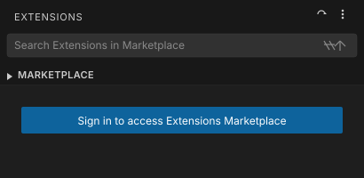
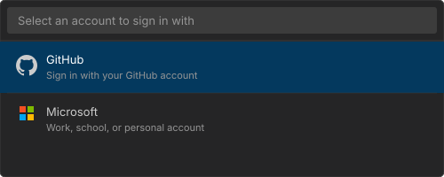
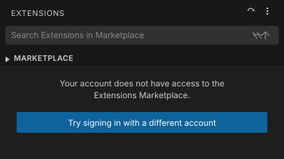
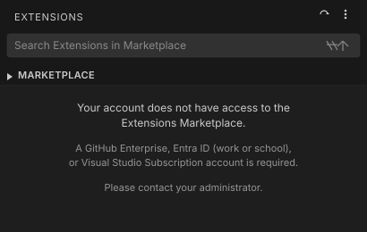

# Plan Summary: Entra ID & Visual Studio Subscription Eligibility for Private Marketplace

> **Issue:** [#280376](https://github.com/microsoft/vscode/issues/280376)

## Overview

The Private Marketplace currently only allows access via GitHub Enterprise / Copilot sign-in, blocking enterprise customers who use Microsoft Entra ID or Visual Studio Subscriptions. This plan adds two new eligibility paths — Entra ID and Visual Studio Subscription — alongside the existing GitHub path.

A new `IMarketplaceEligibilityService` evaluates access across all three paths without modifying the existing Copilot-focused `DefaultAccountProvider`. The Extensions viewlet gets a unified sign-in command with a provider picker (GitHub or Microsoft). Account classification and subscription checks happen server-side on the Private Marketplace — the VS Code client never parses tokens.

### Eligibility Matrix

| Path | Eligible | Notes |
|------|----------|-------|
| GitHub Enterprise / Copilot | Yes | Existing (unchanged) |
| Entra ID (work/school) | Yes | New |
| Visual Studio Subscription | Yes | New — regardless of sign-in type |
| MSA only, no VSS | No | Explicitly excluded |

### Key Architecture Decisions

| Decision | Outcome |
|----------|---------|
| Service design | Separate `IMarketplaceEligibilityService` (not extending `DefaultAccountProvider`) |
| Sign-in UX | Single command with provider picker |
| Account type detection | Server-side classification by Private Marketplace (no client token parsing) |
| VSS entitlement check | Server-side proxy via Private Marketplace → Ev4 API |
| Eligibility API hosting | Private Marketplace (Gallery Backend) |

---

## Plan

### Eligibility Check Flow

1. `GalleryManifestService` → `MarketplaceEligibilityService.checkEligibility()`
2. **Path 1 (GitHub/GHE):** Check existing `DefaultAccountService` — enterprise flag or Copilot SKU match
3. **Path 2 (Entra ID):** If no GitHub access, send Microsoft auth token to Private Marketplace eligibility endpoint. Server validates token and classifies via `tid` claim. Entra ID accounts are eligible.
4. **Path 3 (VSS):** If MSA account, Private Marketplace checks VS Subscription entitlements server-side via Ev4 API. Active qualifying subscription = eligible.
5. First eligible path wins (priority order: GHE → Entra → VSS)

### Sign-In UX

Single sign-in command opens a quick pick with two options: **GitHub** and **Microsoft**. The GitHub path delegates to existing `DefaultAccountService`; the Microsoft path is handled by `MarketplaceEligibilityService`. Flows are intentionally asymmetric — reactive for GitHub (existing ownership), imperative for Microsoft (new).

#### UX Mockups

<table>
<tr>
<th>1. Requires Sign-In</th>
<th>2. Provider Picker</th>
<th>3. Access Denied</th>
</tr>
<tr>
<td></td>
<td></td>
<td>
<br/>

</td>
</tr>
<tr>
<td><em>No accounts signed in</em></td>
<td><em>User clicks sign-in button</em></td>
<td><em>Top: retry with different account<br/>Bottom: all options exhausted</em></td>
</tr>
</table>

### Eligibility Service

**New:** `src/vs/workbench/services/extensionManagement/common/marketplaceEligibility.ts`
- `MarketplaceEligibilityReason` enum (GitHubEnterprise, CopilotSKU, EntraID, VisualStudioSubscription, Ineligible)
- `IMarketplaceEligibility` interface (eligible + reason)
- `IMarketplaceEligibilityService` with `checkEligibility()`, `onDidChangeEligibility`, `signInWithMicrosoft()`

**New:** `src/vs/workbench/services/extensionManagement/browser/marketplaceEligibilityService.ts`
- Injects `IDefaultAccountService`, `IAuthenticationService`, `IRequestService`, `IProductService`, `ILogService`, `IContextKeyService`, `ITelemetryService`
- Evaluates three paths in priority order; caches results with TTL
- Subscribes to `onDidChangeDefaultAccount` and `onDidChangeSessions('microsoft')` for reactivity
- Emits GDPR-compliant `marketplace:eligibility:checked` telemetry with `reason`, `provider`, `hasVSS` fields

### Gallery Manifest Integration

**Modify:** `src/vs/workbench/services/extensionManagement/electron-browser/extensionGalleryManifestService.ts`
- Inject `IMarketplaceEligibilityService`
- Replace `handleDefaultAccountAccess()` to delegate to eligibility service
- Remove `checkAccess()` (logic moved to eligibility service Path 1)
- Subscribe to `onDidChangeEligibility`

### Extensions UI

**Modify:** `src/vs/workbench/contrib/extensions/browser/extensionsViewlet.ts`
- RequiresSignIn: sign-in button opens provider picker
- AccessDenied with checked: "Try signing in with a different account"
- AccessDenied final: explain required account types

**Modify:** `src/vs/workbench/contrib/extensions/browser/extensions.contribution.ts`
- Replace GitHub-only `ExtensionsGallerySignInAction` with unified action showing GitHub / Microsoft quick pick

**Modify:** `src/vs/workbench/contrib/extensions/common/extensions.ts`
- Add context keys: `marketplaceEligibilityChecked`, `marketplaceEligibleViaGitHub`, `marketplaceEligibleViaMicrosoft`, `marketplaceEligibleViaVSS`
- Bound and updated by `MarketplaceEligibilityService`

### Product Configuration

**Modify:** `src/vs/base/common/product.ts` — add to `extensionsGallery` interface:

```typescript
readonly eligibilityUrl?: string;             // Private Marketplace eligibility endpoint
readonly microsoftAuthScopes?: string[];       // Scopes for 'microsoft' auth provider
```

**Modify:** `product.json` — add new fields to `extensionsGallery`:

```jsonc
"extensionsGallery": {
    // ... existing fields ...
    "eligibilityUrl": "<TBD: Private Marketplace eligibility endpoint>",
    "microsoftAuthScopes": ["<TBD: scopes for classification + VSS>"]
}
```

**Modify:** `product.json` — add `microsoft` to `trustedExtensionAuthAccess`:

```jsonc
"trustedExtensionAuthAccess": {
    "github": ["GitHub.copilot-chat"],
    "github-enterprise": ["GitHub.copilot-chat"],
    "microsoft": []
}
```

The `microsoft` entry reserves the key for future extension-based callers. Since the eligibility service runs in the workbench (main process), it may not need explicit trust — but this should be verified during implementation by testing whether `getSessions('microsoft')` returns sessions without a trust prompt.

---

## Open Questions / Dependencies

- Private Marketplace eligibility endpoint URL and API contract (TBD)
- Ev4 onboarding: Private Marketplace AAD app registration with VS Subscriptions team
- Microsoft auth scopes for eligibility endpoint (TBD)
- Qualifying `subscriptionLevelCode` / `subscriptionChannel` combinations (coordinate with Aaron Mast / Chee Seong Ong)
- Air-gapped deployment fallback policy (classification works offline; VSS check requires connectivity)
